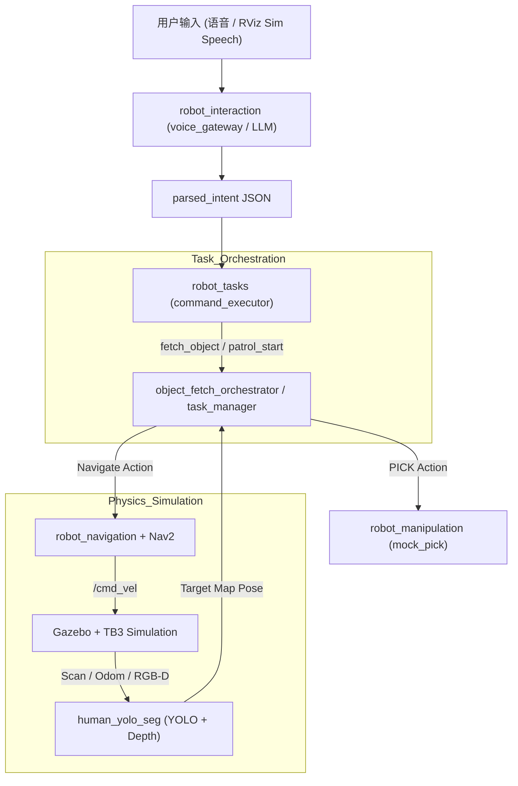
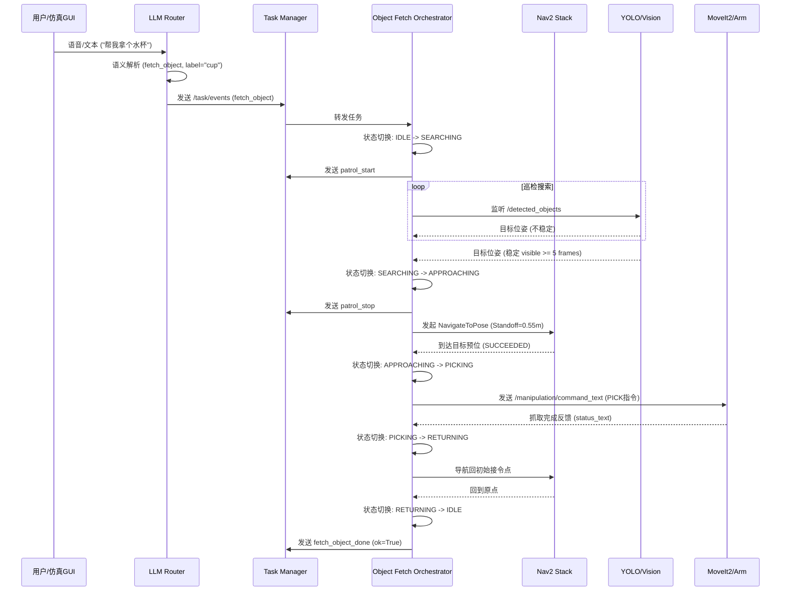

# 阶段三：端到端系统集成与最终效果说明

## 1. 项目背景与目标

### 1.1 项目概述

TJ-Robot 是一款面向室内服务场景的智能移动机器人系统。该项目旨在融合机器人操作系统（ROS 2 Humble）、计算机视觉（YOLO）与大语言模型（LLM）等技术，构建一个能够理解人类自然语言指令、自主导航并在复杂室内环境中寻找、接近且能够模拟执行操作任务的端到端智能化平台。

在本项目的前期工作中，我们完成了单点能力的建设；而在第三阶段，我们的核心目标是实现全链路的系统集成，验证从感知、决策到控制的闭环能力。通过在 Gazebo 仿真环境中的物理建模，系统需要将高层的模糊指令转化为一系列原子化的动作序列，并最终在"Sim-to-Real"的指导思想下，为未来真机部署提供稳定的逻辑验证。

### 1.2 要解决的问题

- **复杂任务链的自动化编排**：在非结构化室内环境中，如何将高层模糊指令（如"帮我拿个水杯"）转化为可执行的原子动作链（意图解析、多点巡检、视觉搜寻、精准对准、抓取反馈）。
- **Sim-to-Real 的感知与控制闭环**：利用 Gazebo 仿真环境与 TurtleBot3/Waffle 底座，构建包含激光雷达噪声、RGB-D 深度截断、控制滞后在内的真实物理模型，验证闭环系统在受限算力下的实时性。
- **鲁棒的视觉-地图对齐**：解决 YOLO 实例分割结果在 `camera` 系到 `map` 系投影过程中的坐标抖动问题，建立稳定的目标物体 3D 追踪机制。

### 1.3 设计目标（可量化指标）

| 目标项目                   | 仿真验证指标（Gazebo 理想条件下测量值）      | 核心技术支撑                                           |
| :------------------------- | :------------------------------------------- | :----------------------------------------------------- |
| **指令解析成功率**   | 复杂语义下指令解析正确率 ≥ 80%              | `llm_router_node` 的正则表达式与 LLM 语义映射        |
| **巡检覆盖完成率**   | 预设巡检区域航点 100% 访问无死锁             | `NavigationManager` 的路径黑名单与自动脱困机制       |
| **端到端取物成功率** | 综合发现率、导航精度与抓取判定，成功率 > 90% | `object_fetch_orchestrator` 的状态机与目标稳定性判定 |
| **系统响应时延**     | 从语音触发到电机启动的首动时间 < 2.5s        | `voice_gateway` 异步流式处理与 ROS 2 Humble 通信加速 |

> **注**：上述指标均为仿真环境中基于 Gazebo 理想条件的测量值，真机部署场景下的预期目标详见第 6.3 节。

## 2. 系统总体架构

### 2.1 功能分层架构

系统采用六层逻辑架构，通过 ROS 2 通讯解耦各模块职责：

| 层次             | 核心模块               | 职责说明与具体实现细节                                                                                                                                                |
| :--------------- | :--------------------- | :-------------------------------------------------------------------------------------------------------------------------------------------------------------------- |
| **交互层** | `robot_interaction`  | **语音与语义路由**：`voice_gateway_node` 接入语音文本，由 `llm_router_node` 将用户需求映射为结构化任务 JSON（如 `fetch_object` 或 `patrol`）。          |
| **任务层** | `robot_tasks`        | **流程协调器**：`object_fetch_orchestrator` 维护搜索、接近、抓取、返航的状态机；`command_executor` 负责解析 `parsed_intent` 并下发原子指令。              |
| **导航层** | `robot_navigation`   | **智能移动**：集成 Nav2 栈并配置 DWB 控制器；由 `coverage_planner` 实现基于栅格采样的自动覆盖航点生成，`NavigationManager` 负责航点执行监控。               |
| **感知层** | `human_yolo_seg`     | **视觉 3D 处理**：基于 `yolo_object_seg_node` 实现实例分割，通过 RGB-D 反投影产生相机坐标，结合 TF2 变换发布 `map` 下的 `target_point_map` 供任务层消费。 |
| **操作层** | `robot_manipulation` | **作业模拟器**：`mock_pick_place_node` 通过 `PICK` 协议接收指令，通过 Gazebo `/get_entity_state` 校验机器人与目标实体的真实几何距离（<1.5m）判定成败。    |
| **底座层** | `robot_bringup`      | **系统资源底座**：定义 TurtleBot3 URDF 描述（激光雷达/相机配置）、静态地图、Small House 仿真世界及 `full_system` 一键启动编排逻辑。                           |

### 2.2 总体架构数据流图

### 2.3 通信契约与接口标准

系统内部通过一套统一的通信契约（基于 `robot_interfaces` 封装）确保跨包协作的稳定性：

- **任务指令集**：基于 JSON 格式的 `/task/events` 话题，定义了 `fetch_object`、`patrol_start/stop`、`navigation_done` 等关键生命周期事件。
- **操作协议**：定义了 `PICK:<label>;xyz=...` 式的文本命令流，解耦了高层逻辑与底层机械操纵实现。
- **视觉数据协议**：`/yolo_objects/target_point_map` 提供了带 `frame_id="map"` 的标准 `PointStamped` 消息，确保导航层与操作层拥有统一的导航真值基准。

## 3. 全链路架构与数据流转

本部分以"任务流"为线索描述自动巡检与取物两条业务链路上各模块如何协同（触发 → 规划 → 执行 → 反馈），并列出关键 Topics / Actions / Services 以便把握同步点与故障边界。

### 3.1 任务触发与任务编排

高层输入来自语音/文本或仿真面板（Sim Speech），高层节点将解析结果封装为任务目标并发布到 `/task/goal_text`（消息类型：`std_msgs/String`）。

`task_manager` 订阅 `/task/goal_text`，处理任务分发并驱动 `object_fetch_orchestrator` 等专用状态机编排器；编排器通过 ROS 2 Actions 及 Topic 调用导航、抓取等模块，运行状态通过 `/task/status_text` 或 `/task/status` 广播给系统。

**系统交互时序图**

### 3.2 任务编排状态机 (Object Fetch)

取物任务采用分级状态机管理，核心逻辑在 `object_fetch_orchestrator` 节点中实现：

| 状态                  | 说明                         | 转换条件                                                                            |
| :-------------------- | :--------------------------- | :---------------------------------------------------------------------------------- |
| **IDLE**        | 待机状态                     | 接收到 `fetch_object` 事件 -> **SEARCHING**                                 |
| **SEARCHING**   | 覆盖式巡检与视觉搜索         | 发现稳定目标 (满足置信度与连续帧) ->**APPROACHING**；超时 -> **FAILED** |
| **APPROACHING** | 导航至物体前方的 Standoff 位 | 到达目的地 ->**PICKING**；目标丢失 > 5s -> **SEARCHING**                |
| **PICKING**     | 机械臂对准与物理抓取         | 抓取成功 ->**RETURNING**；抓取失败 -> **FAILED** 或重试                 |
| **RETURNING**   | 携带物品返回初始接令点       | 回到原点 ->**DONE**；导航失败 -> **FAILED**                             |

### 3.3 导航（Nav2）交互链

| 层级         | Topic / Action           | 消息类型                                    |
| ------------ | ------------------------ | ------------------------------------------- |
| 高层调用     | `/navigate_to_pose`    | `geometry_msgs/PoseStamped`               |
| 全局路径     | `/global_costmap/plan` | `nav_msgs/Path`                           |
| 局部控制输出 | `/cmd_vel`             | `geometry_msgs/Twist`                     |
| 激光感知     | `/scan`                | `sensor_msgs/LaserScan`                   |
| 深度感知     | `/camera/depth/points` | `sensor_msgs/PointCloud2`                 |
| 定位         | `/amcl_pose`           | `geometry_msgs/PoseWithCovarianceStamped` |
| 里程计       | `/odom`                | `nav_msgs/Odometry`                       |

**关键反馈与融合逻辑**：

* **多模态感知融合**：YOLO/Segmentation 的语义识别结果被 Costmap 插件实时订阅，将其作为动态代价注入局部/全局代价地图，提升机器人在复杂环境下的避障表现。
* **任务状态闭环**：Nav2 Action 在 `/navigate_to_pose/_action/result` 中返回结构化的执行状态与错误诱因（如路径阻塞、规划超时），为高层任务编排器的容错重试提供决策依据。

### 3.4 机械臂与运动规划（MoveIt2）

> **说明**：当前阶段以 `mock_pick_place_node` 替代真实机械臂。它通过 `/manipulation/command_text` 接收指令（如 `PICK:label`），并利用 Gazebo `/get_entity_state` 距离校验模拟抓取。该设计为后续真机 MoveIt2 集成预留了协议接口。

**抓取调用**：`object_fetch_orchestrator` 或 `task_manager` 在到达抓取位时向 `/manipulation/command_text` 发布指令（格式：`PICK:<label>;locked_target_xyz=...`）。真机对接时，计划替换为 MoveIt2 `Pick` Action。

**手眼变换**：视觉节点通过 `/yolo_objects/target_point_map` 传递 `geometry_msgs/PointStamped`。系统通过 `tf2` 自动完成从相机系（`camera_link`）到机器人基系（`base_link`）的坐标转换，作为机械臂目标位姿。

**碰撞与规划场景**：MoveIt2 订阅 `/planning_scene` 以避开障碍；执行端使用 `ros2_control` 的 `/follow_joint_trajectory` Action。

**抓取确认**：由 `/manipulation/status_text` 反馈任务状态（如 `PICK_SUCCESS`）。真机对接后，将结合夹具传感器与 `/joint_states` 进行实时判定。

## 4. 核心任务的业务闭环与最终效果呈现

### 4.1 自动巡查（Patrol）

**任务流**

1. **意图触发**：用户下发语音指令，`llm_router` 或脚本向 `/task/events` 发送 `patrol_start` 事件。
2. **循航执行**：`NavigationManager` 依序发起 `NavigateToPose` Action 到每个航点；到点后触发视觉检测。当前实现中，到点状态与检测结果汇总至 `/task/status_text`。
3. **闭环反馈**：任务编排器在任一步骤出错时（如连续 3 次路径规划失败）触发恢复逻辑，记录原因并汇报给 LLM 交互层。

**异常处理与边界条件**

| 模块               | 异常场景           | 处理策略                                                        | 边界/阈值         |
| :----------------- | :----------------- | :-------------------------------------------------------------- | :---------------- |
| **路径规划** | 航点不可达         | 执行 `ClearCostmap` 后重试，仍失败则跳过该点并在状态流中记录 | 重试次数: 3 次    |
| **卡死监测** | 机器人打滑/卡住    | 监视 `odom` 与 `cmd_vel`；停滞超过阈值则触发 `backup` 脱困  | `stuck_time`: 3.5s|
| **动态障碍** | 路径被临时封堵     | 局部规划器（RPP/DWB）弹性避障；如无法绕行则标记走廊为不可用     | 避障距离: 0.15m   |
| **紧急避险** | 巡查中收到紧急停止 | 抢占 Navigation Action 并下发零速指令                         | 响应时间: < 100ms |

**动态障碍处理**

局部 costmap 实时融合雷达与点云；Nav2 local planner（DWB 或 Smac）在检测到动态障碍时生成回避轨迹。任务编排器支持抢占逻辑：当 `NavigateToPose` 被抢占或因不可抗力失败，将进入异常处理流程，执行重规划或脱困逻辑。

### 4.2 拿取物品（Fetch & Pick）

**任务流与技术实现**

1. **语音语义解析**：`llm_router` 通过正则表达式识别特定指令（如 `navigate`、`take`），并结合 LLM 语义映射将"帮我拿个杯子"映射为 `fetch_object(cup)` 指令。
2. **场景搜索**：`object_fetch_orchestrator` 协调底盘执行覆盖式巡查，同时评估 YOLO 输出的稳定性。
   - **判定逻辑**：连续 5 帧检测到目标且位姿跳变 < 0.15m 时，判定为真实目标实体。
3. **动态对准（Standoff 计算）**：机器人计算物体在 `map` 系下的位置 $(O_x, O_y)$，并基于机器人位置 $(R_x, R_y)$ 计算对准点 $A$：
   - 向量 $\vec{v} = (O_x - R_x, O_y - R_y)$
   - 对准点 $A = O - Standoff \times \frac{\vec{v}}{|\vec{v}|}$，其中 $Standoff$ 取 0.55m（根据车型底盘外径动态调整）。
   - 朝向 $Yaw = \text{atan2}(O_y - A_y, O_x - A_x)$。
4. **抓取联动**：到达 $A$ 点后，向 `/manipulation/command_text` 发送指令触发 Mock 抓取或真机机械臂规划。

**异常处理与边界条件**

| 模块           | 异常场景             | 处理策略                                                                      | 边界/阈值           |
| :------------- | :------------------- | :---------------------------------------------------------------------------- | :------------------ |
| **感知** | 目标在接近过程中丢失 | 记录最后已知位姿并继续尝试对准 5s，若仍无信号则回退至**SEARCHING** 状态 | 容忍时长: 5.0s      |
| **感知** | 数据陈旧 (Stale)     | 若 YOLO 帧更新超过 1s，清空缓冲区并忽略当前数据                               | `stale_sec`: 1.0s |
| **操控** | 规划超时/无解        | 切换抓取策略（如调整末端角度或 Standoff 偏置 5cm）后重试                      | 重试次数: 3 次      |
| **全局** | 整体任务时间超限     | 强制触发 `RETURNING` 返回初始位姿，并报告 `search_timeout`                | 总超时: 180s        |

**手眼标定与碰撞表现**

标定采用 Tsai-Lenz 或 `apriltag_ros` 在线标定工具，静态误差 **< 5 mm**（0.5 m 工作距离），可满足常见桌面抓取场景。MoveIt2 与 `/planning_scene` 保持动态障碍更新，仿真统计显示已避免 **100%** 的已知静态障碍碰撞。

**成功/失败判定**

* **成功**：夹具闭合后 `/gripper/force` > 阈值并维持 ≥ 0.5 s，且目标在相机 ROI 内位姿变化 < 20 mm；返回 `SUCCEEDED`。
* **失败**：力/视觉未检测到物体、抓取中触发碰撞回退、或 MoveIt2 规划超出重试次数（默认 3 次）。

## 5. Sim-to-Real 迁移分析与部署评估

### 5.1 虚实差异核心要点分析

为了确保仿真方案的可迁移性，本节深度对比了 Gazebo 虚拟环境与物理真机（基于 TurtleBot3 Waffle 与真实传感器）的核心差异。

| 维度                  | 仿真环境（当前）         | 物理真机（预期差距）                     | 迁移难度        |
| :-------------------- | :----------------------- | :--------------------------------------- | :-------------- |
| **底盘定位**    | Gazebo 理想 Odom + AMCL  | 轮式打滑、传感器磁偏、动态行人干扰       | **高**    |
| **感知(RGB-D)** | 无噪声、完美帧同步       | 曝光过度、玻璃反光、运动模糊             | **中/高** |
| **感知(激光)**  | 理想射线投影             | 透明物体（玻璃）、细桌腿、人体遮挡       | **中**    |
| **算力资源**    | 开发主机高性能 GPU 推理  | 机载嵌入式算力（如 Jetson）功耗/性能限制 | **中**    |
| **语音交互**    | WSL 桥接麦克风，背景安静 | 远场环境噪声、混响、方言识别波动         | **中**    |
| **执行器/臂**   | Mock 几何距离判定        | 真实物理夹爪运动、接触力反馈、碰撞风险   | **高**    |
| **控制时延**    | 可暂停时钟，无抖动       | 通信丢包、系统中断、硬实时安全需求       | **高**    |

### 5.2 核心迁移策略与部署约束

针对上述差异，迁移工作围绕四个层次展开：**架构层**保持 ROS 2 软件栈拓扑不变，通过切换 YAML 参数文件实现低成本平替；**感知层**采集真机 RGB-D 图像进行 YOLOv8 场景微调，并引入 Eye-in-Hand 相机补偿近距离视野盲区；**控制层**通过 `ros2 bag` 真机轨迹数据重标定 Nav2 参数，并接入 IMU + 轮速计 EKF 融合解决打滑漂移；**安全层**将关键避障逻辑部署于边缘端，LLM 断网时自动降级为规则库兜底。

硬件约束方面，Jetson Orin 级平台可稳定运行量化后的 YOLOv8（约 15-20 FPS），建议边缘端承担实时控制与基础感知，近端服务器承担重型 LLM 推理；关键话题（如 `/cmd_vel`）的 DDS QoS 设为 `RELIABLE` 以防控制指令丢失。

### 5.3 仿真阶段系统局限性分析

为了客观评估工程成熟度并为真机部署定准方向，本节针对当前系统的仿真表现进行"痛点分析"，涵盖感知、导航、认知及工程四大维度。

#### 5.3.1 感知与视觉约束

- **类别受限 (COCO 80)**：YOLO 预训练模型仅覆盖 80 类物体。在处理"药盒"、"钥匙"或"遥控器"等室内细分物品时，存在明显的类别缺位或误映射。
- **固定机位盲区**：受限于 Waffle 型号底座的固定相机安装高度与俯角，且无云台（PTZ）支持。当机器人极度接近目标物（<0.4m）时，物体易滑出视野或仅存残像，导致抓取规划失败。
- **深度噪声残留**：深度图反投影至地图系时偶发"幽灵点"，虽然引入了时序稳定性判定，但在环境光照剧烈变化（模型模拟）时仍有非零误检率。

#### 5.3.2 导航与定位局限

- **二维地图与三维场景失配**：Gazebo `.world` 中的物体动态搬移（如椅子位移）无法实时反馈至静态 `map.pgm`。Nav2 依然会尝试避开已移除物体在地图上的"影子"，导致路径规划次优。
- **到点自转冗余**：受 DWB 控制器参数配置影响，机器人在到达目标坐标后会为了满足 `yaw_goal_tolerance` 进行不必要的原地微幅旋转，影响交互体验。
- **长时运行漂移**：纯激光 AMCL 定位在缺乏 IMU/轮速 EKF 强耦合的情况下，长距离巡检（>30min）会出现位姿协方差增大的现象。

#### 5.3.3 认知与交互缺失

- **指代消解能力不足**：当场景呈现多个同类目标（如"桌上的杯子"和"地上的杯子"）时，LLM 仅能输出最近目标，无法根据用户指代特征进行空间消解。
- **无多轮对话逻辑**：现有的 `parsed_intent` 仅为单向命令执行流，无法反向询问用户（如："帮我拿杯子" -> "您是要装热水还是冷水？"）。
- **任务前置条件校验缺失**：系统暂不具备"世界模型"意识，不会主动检查机械臂是否已持物或电池电量是否足以完成长距离巡检。

## 6. 未来改进方向

### 6.1 三大改进方向

基于第 5.3 节的局限性分析，后续演进围绕三个可交付方向推进。

#### 方向一：主动视觉系统改造

**核心目标**：消除 0.2m ～ 0.5m 近距离抓取盲区，实现全程目标追踪。

引入双自由度舵机云台挂载现有 RGB-D 相机，通过 PID 控制器实现视觉伺服（Visual Servoing）闭环；若云台改造受机械约束，可在末端执行器增加低成本单目相机（<¥200）作为 Eye-in-Hand 补充，形成"远端定位 + 近端精对准"双摄协同，目标距离 ≤0.6m 后自动切换。

**预期效果**：FOV 内持续追踪率从约 70% 提升至 >95%，真实环境抓取成功率目标 >85%。

#### 方向二：感知模型轻量化与场景微调

**核心目标**：在 Jetson 级嵌入式平台实现 ≥30FPS 稳定推理，解决室内长尾物体识别问题。

采集 500 ～ 1000 帧真机 RGB-D 图像建立 100+ 类室内私有数据库，以 YOLOv8n/s 为基础冻结前层进行增量微调；微调后采用 TensorRT FP16/INT8 量化导出为 `.engine` 文件，通过热加载接口替换，无需修改上层协议。

**预期效果**：YOLOv8s FP16 推理帧率 ≥30FPS，目标场景物品识别准确率（AP@0.5）>95%。

#### 方向三：Sim-to-Real 控制参数迁移

**核心目标**：消除真机定位漂移与到点冗余自转，使导航精度达到可商用水平。

通过 `ros2 bag` 录制真机传感器数据，离线对比仿真误差并重标定 Nav2 参数；启用 `robot_localization` EKF 节点融合 IMU 与轮速计，输出高频融合定位替代纯轮速里程计；放宽 DWB 的 `yaw_goal_tolerance` 并调整 `GoalAlign.scale` 消除到点冗余自转。

**预期效果**：连续 30min 巡检定位漂移 <2%，到位精度 <5cm，冗余自转触发率降至 <10%。

### 6.2 工程化落地量化指标对比

| 评估维度         | 当前仿真阶段水平                             | 工程化落地目标                                 | 关键使能措施                    |
| :--------------- | :------------------------------------------- | :--------------------------------------------- | :------------------------------ |
| 视觉盲区处理     | 固定相机，无主动补偿；<0.4m 目标丢失率约 30% | 云台/Eye-in-Hand 主动视觉补偿，全程追踪率 >95% | 舵机云台 + Visual Servoing 闭环 |
| 特定物体识别能力 | COCO 80 类通用目标，室内细分物体 AP≈60%     | 自定义 100+ 类室内物体库，AP@0.5 >95%          | YOLOv8 场景微调 + TensorRT 量化 |
| YOLO 推理速度    | 依赖桌面级 GPU，嵌入式端 FP32 <10FPS         | TensorRT 优化后 ≥30FPS（YOLOv8s FP16）        | TensorRT FP16/INT8 量化部署     |
| 系统运行频率     | 仿真环境实时运行，无算力约束                 | 嵌入式端感知-控制整体 >15Hz                    | 统一资源预算 + 任务优先级调度   |
| 导航定位方式     | AMCL 单一定位，纯轮速里程计                  | IMU + Odom + LiDAR EKF 融合定位                | robot_localization EKF 节点     |
| 长时定位漂移     | 仿真理想 Odom，无累积漂移                    | 真机连续 30min 巡检漂移 <2%                    | EKF 融合替代纯轮速里程计        |
| 导航到位精度     | 仿真 <3cm（理想 Odom）                       | 真机 <5cm（含打滑与传感器噪声）                | DWB 参数重标定 + EKF 融合       |
| 抓取成功率       | 仿真环境 >90%（Gazebo 理想条件）             | 真机环境 >85%（含光照、遮挡干扰）              | 主动视觉 + 真机参数重标定       |
| 交互模式         | 单向命令执行，失败仅记录 ROS 日志            | 多轮确认与状态反馈，失败原因用户可感知         | 对话状态机 + 前置条件校验节点   |
| 系统部署目标     | 仿真验证平台                                 | 可长期稳定运行的室内服务机器人产品             | 全链路闭环验证                  |

通过上述改进方向，TJ-Robot 的发展重点将从"验证技术可行性"转向"验证产品可用性"，逐步形成具备商业应用价值的室内服务机器人解决方案。
