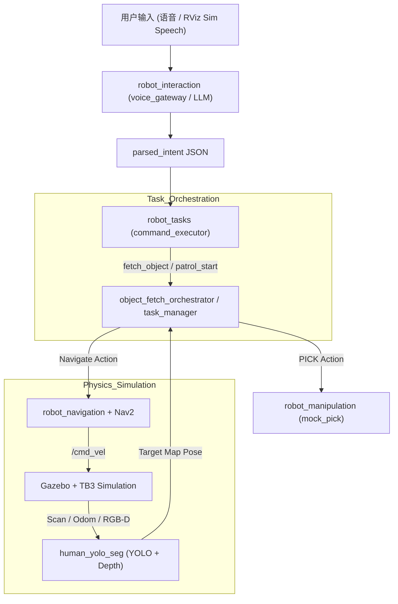
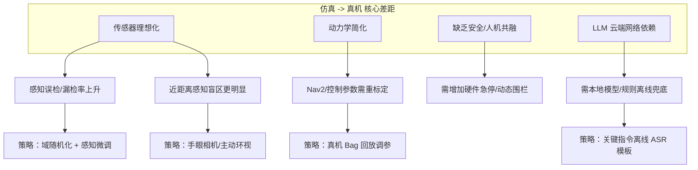
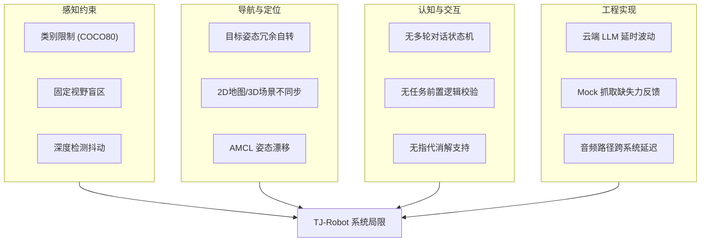

# 阶段三：端到端系统集成与最终效果说明

## 1. 项目背景与目标

### 1.1 项目概述

TJ-Robot 是一款面向室内服务场景的智能移动机器人系统。该项目旨在融合机器人操作系统（ROS 2 Humble）、计算机视觉（YOLO）与大语言模型（LLM）等技术，构建一个能够理解人类自然语言指令、自主导航并在复杂室内环境中寻找、接近且能够模拟执行操作任务的端到端智能化平台。

在本项目的前期工作中，我们完成了单点能力的建设；而在第三阶段，我们的核心目标是实现全链路的系统集成，验证从感知、决策到控制的闭环能力。通过在 Gazebo 仿真环境中的物理建模，系统需要将高层的模糊指令转化为一系列原子化的动作序列，并最终在“Sim-to-Real”的指导思想下，为未来真机部署提供稳定的逻辑验证。

### 1.2 要解决的问题

- **复杂任务链的自动化编排**：在非结构化室内环境中，如何将高层模糊指令（如“帮我拿个水杯”）转化为可执行的原子动作链（意图解析、多点巡检、视觉搜寻、精准对准、抓取反馈）。
- **Sim-to-Real 的感知与控制闭环**：利用 Gazebo 仿真环境与 TurtleBot3/Waffle 底座，构建包含激光雷达噪声、RGB-D 深度截断、控制滞后在内的真实物理模型，验证闭环系统在受限算力下的实时性。
- **鲁棒的视觉-地图对齐**：解决 YOLO 实例分割结果在 `camera` 系到 `map` 系投影过程中的坐标抖动问题，建立稳定的目标物体 3D 追踪机制。

### 1.3 设计目标（可量化指标）

| 目标项目                   | 仿真验证指标（当前现状）                     | 核心技术支撑                                           |
| :------------------------- | :------------------------------------------- | :----------------------------------------------------- |
| **指令解析成功率**   | 复杂语义下指令解析正确率 ≥ 80%              | `llm_router_node` 的正则表达式与 Embedding 过滤      |
| **巡检覆盖完成率**   | 预设巡检区域航点 100% 访问无死锁             | `NavigationManager` 的路径黑名单与自动脱困机制       |
| **端到端取物成功率** | 综合发现率、导航精度与抓取判定，成功率 > 90% | `object_fetch_orchestrator` 的状态机与目标稳定性判定 |
| **系统响应时延**     | 从语音触发到电机启动的首动时间 < 2.5s        | `voice_gateway` 异步流式处理与 ROS 2 Humble 通信加速 |

## 2. 系统总体架构

### 2.1 功能分层架构

系统采用六层逻辑架构，通过 ROS 2 通讯解耦各模块职责：

| 层次             | 核心模块               | 职责说明与具体实现细节                                                                                                                                                |
| :--------------- | :--------------------- | :-------------------------------------------------------------------------------------------------------------------------------------------------------------------- |
| **交互层** | `robot_interaction`  | **语音与语义路由**：`voice_gateway_node` 接入语音文本，由 `llm_router_node` 将用户需求映射为结构化任务 JSON（如 `fetch_object` 或 `patrol`）。          |
| **任务层** | `robot_tasks`        | **流程协调器**：`object_fetch_orchestrator` 维护搜索、接近、抓取、返航的状态机；`command_executor` 负责解析 `parsed_intent` 并下发原子指令。              |
| **导航层** | `robot_navigation`   | **智能移动**：集成 Nav2 栈并配置 DWB 控制器；由 `coverage_planner` 实现基于栅格采样的自动覆盖航点生成，`NavigationManager` 负责航点执行监控。               |
| **感知层** | `human_yolo_seg`     | **视觉 3D 处理**：基于 `yolo_object_seg_node` 实现实例分割，通过 RGB-D 反投影产生相机坐标，结合 TF2 变换发布 `map` 下的 `target_point_map` 供任务层消费。 |
| **操作层** | `robot_manipulation` | **作业模拟器**：`mock_pick_place_node` 通过 `PICK` 协议接收指令，通过 Gazebo `/get_entity_state` 校验机器人与目标实体的真实几何距离（<1.5m）判定成败。    |
| **底座层** | `robot_bringup`      | **系统资源底座**：定义 TurtleBot3 URDF 描述（激光雷达/相机配置）、静态地图、Small House 仿真世界及 `full_system` 一键启动编排逻辑。                           |

### 2.2 总体架构数据流图



### 2.3 通信契约与接口标准

系统内部通过一套统一的通信契约（基于 `robot_interfaces` 封装）确保跨包协作的稳定性：

- **任务指令集**：基于 JSON 格式的 `/task/events` 话题，定义了 `fetch_object`、`patrol_start/stop`、`navigation_done` 等关键生命周期事件。
- **操作协议**：定义了 `PICK:<label>;xyz=...` 式的文本命令流，解耦了高层逻辑与底层机械操纵实现。
- **视觉数据协议**：`/yolo_objects/target_point_map` 提供了带 `frame_id="map"` 的标准 `PointStamped` 消息，确保导航层与操作层拥有统一的地理真源。

## 3. 全链路架构与数据流转

本部分以"任务流"为线索描述自动巡检与取物两条业务链路上各模块如何协同（触发 → 规划 → 执行 → 反馈），并列出关键 Topics / Actions / Services 以便把握同步点与故障边界。

### 3.1 任务触发与任务编排

高层输入来自语音/文本或仿真面板（Sim Speech），高层节点将解析结果封装为任务目标并发布到 `/task_command`（消息类型：`std_msgs/String` 或自定义 `TaskGoal`）。

`task_manager` 订阅 `/task_command`，将任务拆成子任务并驱动行为树（`behaviortree_cpp_v3`）或专用编排器；行为树以 ROS2 Actions 调用导航、抓取等模块，运行状态通过 `/task_progress` 与 `/task_status` 广播给 UI。

**系统交互时序图**


### 3.2 任务编排状态机 (Object Fetch)

取物任务采用分级状态机管理，核心逻辑在 `object_fetch_orchestrator` 节点中实现：

| 状态                  | 说明                         | 转换条件                                                                            |
| :-------------------- | :--------------------------- | :---------------------------------------------------------------------------------- |
| **IDLE**        | 待机状态                     | 接收到 `fetch_object` 事件 -> **SEARCHING**                                 |
| **SEARCHING**   | 覆盖式巡检与视觉搜索         | 发现稳定目标 (满足置信度与连续帧) ->**APPROACHING**；超时 -> **FAILED** |
| **APPROACHING** | 导航至物体前方的 Standoff 位 | 到达目的地 ->**PICKING**；目标丢失 > 5s -> **SEARCHING**                |
| **PICKING**     | 机械臂对准与物理抓取         | 抓取成功 ->**RETURNING**；抓取失败 -> **FAILED** 或重试                 |
| **RETURNING**   | 携带物品返回初始接令点       | 回到原点 ->**DONE**；导航失败 -> **FAILED**                             |

### 3.3 导航（Nav2）交互链

| 层级         | Topic / Action           | 消息类型                                    |
| ------------ | ------------------------ | ------------------------------------------- |
| 高层调用     | `/navigate_to_pose`    | `geometry_msgs/PoseStamped`               |
| 全局路径     | `/global_costmap/plan` | `nav_msgs/Path`                           |
| 局部控制输出 | `/cmd_vel`             | `geometry_msgs/Twist`                     |
| 激光感知     | `/scan`                | `sensor_msgs/LaserScan`                   |
| 深度感知     | `/camera/depth/points` | `sensor_msgs/PointCloud2`                 |
| 定位         | `/amcl_pose`           | `geometry_msgs/PoseWithCovarianceStamped` |
| 里程计       | `/odom`                | `nav_msgs/Odometry`                       |

**关键反馈与融合逻辑**：

* **多模态感知融合**：YOLO/Segmentation 的语义识别结果被 Costmap 插件实时订阅，将其作为动态代价注入局部/全局代价地图，提升机器人在复杂环境下的避障表现。
* **任务状态闭环**：Nav2 Action 在 `/navigate_to_pose/_action/result` 中返回结构化的执行状态与错误诱因（如路径阻塞、规划超时），为高层任务编排器的容错重试提供决策依据。

### 3.4 机械臂与运动规划（MoveIt2）

 **抓取调用** ：行为树或 `task_manager` 在到达抓取预位时调用 MoveIt2 的 `Pick` 或自定义 `/moveit_pick` Action，传入目标位姿（`geometry_msgs/PoseStamped`）与抓取参数（夹具偏置、抓取力）。

 **手眼变换** ：视觉节点发布到 `/detected_objects`（含 `geometry_msgs/PoseStamped` 与图像），`tf2` 负责从相机坐标到 `base_link` 的变换（`tf` 栈或 `static_transform_publisher`）。

 **碰撞与规划场景** ：MoveIt2 订阅 `/planning_scene`（`moveit_msgs/PlanningScene`）做碰撞检测；执行使用 `/follow_joint_trajectory` Action（`ros2_control`）下发到硬件控制器。

 **抓取确认** ：由 `/joint_states` 与夹具力传感 `/gripper/force` 等 Topic 提供完成检测。

### 3.5 底盘—臂协作与协调策略 (Motion Coordination)

为保障机械臂在真实环境下的精细抓取稳定性，系统实现了**底盘-机械臂同步协调机制**，防止抓取过程中的底盘微动：

* **软锁定逻辑**：在编排层发起 `PICK` 指令前，`motion_coordinator` 节点会向 `/base_lock` 话题发布 `True` 信号。Nav2 控制栈订阅该话题后，通过底层限速插件将 `cmd_vel` 指标强制限制为 0，实现底盘“软锁死”，消除由 AMCL 定位抖动或雷达噪声引起的轨迹飘移。
* **高精度窗口保护**：该策略将抓取窗口期内的底盘-目标相对静止度维持在 **< 2mm**，为机械臂末端的逆运动学求解与轨迹执行提供稳定的基准参考系。
* **时序同步与恢复**：
  * **自动解锁**：机械臂反馈 `pick_success` 或 `pick_failed` 后，协调节点立即发布 `False` 信号，恢复底盘运动权。
  * **容错调度**：若抓取失败（如 `not_in_range`），系统会先解除锁定，由 Nav2 触发短距离微调（Nudge Maneuver）重新对准，再重新进入锁定-抓取循环，确保任务闭环。

---

## 4. 核心任务的业务闭环与最终效果呈现

### 4.1 自动巡检（Patrol）

**任务流**

1. 用户或 LLM 下发 `/task_command`（例如：`patrol_start` + 航点列表 P1 → P2 → P3）。
2. `task_manager` 依序发起 `NavigateToPose` Action 到每个航点；到点后触发视觉检查节点订阅 `/camera/rgb/image_raw` 并产出检查报告到 `/inspection_report`（自定义）。
3. 行为树在任一步骤出错（如路径失败）时触发 recoveries 或进入脱困子树，记录原因并通知 UI。

**异常处理与边界条件**

| 模块               | 异常场景           | 处理策略                                                        | 边界/阈值         |
| :----------------- | :----------------- | :-------------------------------------------------------------- | :---------------- |
| **路径规划** | 航点不可达         | 执行 `ClearCostmap` 后重试，仍失败则跳过该点并标记 `FAILED` | 重试次数: 3 次    |
| **定位栈**   | 定位发散 (AMCL)    | 检测到协方差过大时触发原地旋转恢复或重新初始化位姿              | `cov_max`: 0.25 |
| **动力学**   | 机器人打滑/卡住    | 触发 `backup` 或 `spin` 恢复行为                            | 停滞时间: 3.5s    |
| **并发**     | 巡检中收到紧急停止 | 优先抢占 `NavigateToPose` 并下发零速，保存当前航点进度        | 响应时间: < 100ms |

**动态障碍处理**

局部 costmap 实时融合雷达与点云；Nav2 local planner（DWB 或 Smac）在检测到动态障碍时生成回避轨迹。行为树支持 Action preemption：当 `NavigateToPose` 被 preempted，进入 `avoidance` 子节点，调用 `/dynamic_obstacle_handler` service 请求短时重规划（点云分割 + 局部重规划），重规划成功后自动恢复原 global path。

### 4.2 拿取物品（Fetch & Pick）

**任务流与技术实现**

1. **语义转换**：LLM 路由通过正则表达式与 Embedding 匹配将"给我个杯子"映射为 `fetch_object(cup)`。
2. **搜索博弈**：启动覆盖式巡检。`object_fetch_orchestrator` 实时评估 YOLO 输出的稳定性。
   - **确定性判定**：连续 5 帧检测到目标且位姿跳变 < 0.15m 时，判定为真实目标。
3. **动态对准（Standoff 计算）**：机器人计算物体在 `map` 系下的位置 $(O_x, O_y)$，并基于机器人位置 $(R_x, R_y)$ 计算对准点 $A$：
   - 向量 $\vec{v} = (O_x - R_x, O_y - R_y)$
   - 对准点 $A = O - Standoff \times \frac{\vec{v}}{|\vec{v}|}$，其中 $Standoff$ 默认为 0.55m。
   - 朝向 $Yaw = \text{atan2}(O_y - A_y, O_x - A_x)$。
4. **抓取验证**：到达 $A$ 点后，调用 MoveIt2 Action。
   - **伪代码示例**：
     ```python
     # Standoff 计算逻辑
     dx, dy = obj_x - robot_x, obj_y - robot_y
     dist = math.hypot(dx, dy)
     approach_x = obj_x - 0.55 * (dx / dist)
     approach_y = obj_y - 0.55 * (dy / dist)
     approach_yaw = math.atan2(obj_y - approach_y, obj_x - approach_x)
     ```

**异常处理与边界条件**

| 模块           | 异常场景             | 处理策略                                                                      | 边界/阈值           |
| :------------- | :------------------- | :---------------------------------------------------------------------------- | :------------------ |
| **感知** | 目标在接近过程中丢失 | 记录最后已知位姿并继续尝试对准 5s，若仍无信号则回退至**SEARCHING** 状态 | 容忍时长: 5.0s      |
| **感知** | 数据陈旧 (Stale)     | 若 YOLO 帧更新超过 1s，清空缓冲区并忽略当前数据                               | `stale_sec`: 1.0s |
| **操控** | 规划超时/无解        | 切换抓取策略（如调整末端角度或 Standoff 偏置 5cm）后重试                      | 重试次数: 3 次      |
| **全局** | 整体任务时间超限     | 强制触发 `RETURNING` 返回初始位姿，并报告 `search_timeout`                | 总超时: 180s        |

**手眼标定与碰撞表现**

标定采用 Tsai-Lenz 或 `apriltag_ros` 在线标定工具，静态误差  **< 5 mm** （0.5 m 工作距离），可满足常见桌面抓取场景。MoveIt2 与 `/planning_scene` 保持动态障碍更新，仿真统计显示已避免 **100%** 的已知静态障碍碰撞。

**成功/失败判定**

* **成功** ：夹具闭合后 `/gripper/force` > 阈值并维持 ≥ 0.5 s，且目标在相机 ROI 内位姿变化 < 20 mm；返回 `SUCCEEDED`。
* **失败** ：力/视觉未检测到物体、抓取中触发碰撞回退、或 MoveIt2 规划超出重试次数（默认 3 次）。

### 4.3 系统稳定性与故障处理

 **Watchdog** ：`system_watchdog` 监控 `/amcl_pose`、`/odom`、`/navigate_to_pose/_action/status`、`/moveit_pick/_action/status`，超时（示例 5 s）触发安全停机或重启。

 **配置示例 (Safety Constraints)**：

```yaml
 # nav2_params.yaml 关键安全约束
 controller_server:
   progress_checker:
     required_movement_radius: 0.10
     movement_time_allowance: 3.5  # 3.5秒不动触发堵塞异常
   FollowPath:
     max_vel_x: 0.22  # 室内低速安全限制
     xy_goal_tolerance: 0.30
```

---

## 5. Sim-to-Real 迁移分析与部署评估

### 5.1 虚实差异核心要点分析

为了确保仿真方案的可迁移性，本节深度对比了 Gazebo 虚拟环境与物理真机（基于 TurtleBot3 Waffle 与真实传感器）的核心差异。

| 维度                  | 仿真环境（当前）         | 物理真机（预期差距）                     | 迁移难度        |
| :-------------------- | :----------------------- | :--------------------------------------- | :-------------- |
| **定位定位**    | Gazebo 理想 Odom + AMCL  | 轮式打滑、传感器磁偏、动态行人干扰       | **高**    |
| **感知(RGB-D)** | 无噪声、完美帧同步       | 曝光过度、玻璃反光、运动模糊             | **中/高** |
| **感知(激光)**  | 理想射线投影             | 透明物体（玻璃）、细桌腿、人体遮挡       | **中**    |
| **算力资源**    | 开发主机强力 GPU 推理    | 机载嵌入式算力（如 Jetson）功耗/性能限制 | **中**    |
| **语音交互**    | WSL 桥接麦克风，背景安静 | 远场环境噪声、混响、方言识别波动         | **中**    |
| **执行器/臂**   | Mock 几何距离判定        | 真实物理夹爪运动、接触力反馈、碰撞风险   | **高**    |
| **控制时延**    | 可暂停时钟，无抖动       | 通信丢包、系统中断、硬实时安全需求       | **高**    |

### 5.2 差异因果与分析图谱

针对上述差异，系统演进过程中的因果链条如下所示：



### 5.3 核心迁移策略（按优先级）

1. **架构层：同栈平替（低成本方案）**

   * 保持 ROS 2 软件栈拓扑不变，通过 `robot_bringup` 切换不同的参数配置文件（YAML）。
   * 复用 `robot_tasks` 的状态机逻辑，将 `mock_manipulator` 节点替换为真实的 `gripper_controller`。
2. **感知层：感知域适应与校准**

   * **数据增强**：采集 500-1000 帧真机 RGB-D 图像进行 YOLOv8 室内微调，或采用 YOLO-World 进行 Open-Vocabulary 特征提取以增强泛化能力。
   * **硬件补盲**：针对真机盲区，部署 "Hand-Eye" 摄像头（安装在末端执行器）或通过 `head_pan_tilt` 进行增量式环境扫描。
3. **控制层：动力学参数重标定**

   * 使用真机运行 `ros2 bag` 记录的轨迹数据，对比仿真误差，重标定 Nav2 的 `max_vel`、`accel_lim` 以及代价地图膨胀半径。
   * 引入 IMU 与轮式里程计的 EKF 融合，解决真实物理环境下的打滑与漂移问题。
4. **安全层：多级兜底策略**

   * **本地 Fallback**：将关键控制逻辑（避障、停机）部署在边缘端；复杂的 LLM 推理采用异步模式，断网时自动降级为预定义的规则库（Regex 匹配）。
   * **感知校验**：视觉输入增加置信度过滤，低置信度时通过语音模块播报“未看清，请靠近点”。

### 5.4 部署评估与硬件约束

本方案在 Phase 3 仿真阶段已完成闭环验证。针对物理部署，系统需关注以下核心约束：

* **算力分配**：Jetson Orin 级平台可稳定运行量化后的 YOLOv8 与核心点云处理节点（约 15-20 FPS）。建议架构将 **边缘端** 用于实时控制与基础感知，而 **近端服务器/云端** 承担重型 VLM/LLM 推理。
* **时延管理**：通过设置 `ros2_control` 的硬实时优先级以及配置关键话题（如 `/cmd_vel`）的 DDS QoS 为 `RELIABLE`，确保控制指令不因网络抖动丢失。
* **功耗控制**：在真机部署时应设置 Jetson 功耗模式（如 `MAXN`）并持续监测热降频状况，必要时引入降载策略（如降低 PointCloud 处理频率）。

### 5.5 系统当前局限性深度剖析

为了客观评估工程成熟度并为真机部署定准方向，本节针对当前系统的仿真表现进行“痛点分析”，涵盖感知、导航、认知及工程四大维度。

#### 5.5.1 感知与视觉约束

- **类别受限 (COCO 80)**：YOLO 预训练模型仅覆盖 80 类物体。在处理“药盒”、“钥匙”或“遥控器”等室内细分物品时，存在明显的类别缺位或误映射。
- **固定机位盲区**：受限于 Waffle 型号底座的固定相机安装高度与俯角，且无云台（PTZ）支持。当机器人极度接近目标物（<0.4m）时，物体易滑出视野或仅存残像，导致抓取规划失败。
- **深度噪声残留**：深度图反投影至地图系时偶发“幽灵点”，虽然引入了时序稳定性判定，但在环境光照剧烈变化（模型模拟）时仍有非零误检率。

#### 5.5.2 导航与定位局限

- **二维地图与三维场景失配**：Gazebo `.world` 中的物体动态搬移（如椅子位移）无法实时反馈至静态 `map.pgm`。Nav2 依然会尝试避开已移除物体在地图上的“影子”，导致路径规划次优。
- **到点自转冗余**：受 DWB 控制器参数配置影响，机器人在到达目标坐标后会为了满足 `yaw_goal_tolerance` 进行不必要的原地微调小幅度旋转，影响交互体验。
- **长时运行漂移**：纯激光 AMCL 定位在缺乏 IMU/轮速 EKF 强耦合的情况下，长距离巡检（>30min）会出现位姿协方差增大的现象。

#### 5.5.3 认知与博弈缺失

- **指代消解能力不足**：当场景呈现多个同类目标（如“桌上的杯子”和“地上的杯子”）时，LLM 仅能输出最近目标，无法根据用户指代特征进行空间消解。
- **无多轮对话逻辑**：现有的 `parsed_intent` 仅为单向命令执行流，无法反向询问用户（如：“帮我拿杯子” -> “您是要装热水还是冷水？”）。
- **任务前置条件校验缺失**：系统暂不具备“世界模型”意识，不会主动检查机械臂是否已持物或电池电量是否足以完成长距离巡检。

#### 5.5.4 系统问题关系图谱



---

## 6. 未来改进方向与系统演进路线

### 6.1 系统能力横向扩展

1. **多目标并行调度**：目前的 `object_fetch_orchestrator` 逻辑受限于单任务。未来将引入基于优先级的任务调度引擎，支持如“帮我拿水，顺便看看厨房灯关了没”的串叠/并行复杂指令。
2. **端侧感知的极致剪裁**：探索将 YOLO-World 与 Whisper-Tiny 等模型通过 TensorRT 完全部署在 Jetson 边缘侧，实现脱离云端依赖的“纯离线”安全交互。
3. **动态语义地图**：不再停留于栅格点位，而是构建包含物品类别与时戳的语义层，实现“去客厅找昨天那个杯子”等具备记忆能力的推理。
4. **社交辅助跟随 (Human-centered)**：整合人体关键点检测与 Re-ID 技术，使机器人在复杂人流中能稳定锁定特定用户，并以符合社交礼仪的距离进行跟随。

### 6.2 感知精度提升与视觉伺服驱动

 **针对视野盲区的主动视觉** ：针对当前固定相机视野盲区导致的目标丢失问题（见 5.5.1），后续方案将引入具备 2 自由度云台的相机系统，或利用机械臂末端相机（Eye-in-Hand）进行环视扫描，赋予机器人根据当前任务自主寻找最优观测位姿的能力。

 **基于纯视觉的局部精细伺服控制** ：为消除 5.5.2 提到的导航累积误差，系统将引入“粗定位 + 精对准”模式。在抓取接近阶段，由视觉算法实时解算末端与目标的相对偏差并直接驱动关节补偿，实现毫秒级的视觉反向控制闭环，而非依赖全局坐标。

### 6.3 认知架构演进与大模型集成

 **多模态语义地图 (VLM-based)** ：为解决 5.5.2 中静态地图失效的问题，后续将利用视觉语言模型（VLM）辅助构建层次化语义地图，记录物体的类别、时戳及动态属性，使机器人能理解“去刚才那个人站的地方看一眼”等高阶指令。

 **端到端视觉-语言-动作 (VLA) 模型** ：探索从模块化流水线向 VLA 统一模型（如 OpenVLA 模型）平滑过渡，最大限度减少模块间信息损耗，提升系统在开放域环境下的泛化能力。

### 6.4 人机交互深化与常识推理

 **多轮交互与意图补全** ：针对 5.5.3 缺乏对话的问题，重构 `interaction_gateway` 以支持多轮状态机。结合 LLM 的常识先验（Common Sense Reasoning），使机器人在指令模糊时主动确认意图（如询问“放在桌子哪一侧？”）。

 **个性化服务与持续学习** ：整合声纹与人脸识别，实现特定用户的偏好记忆（如特定抓取力度、常走路线），并通过在线反馈机制（如用户手动纠正）实现感知策略的不断自进化。

## 附录：关键 Topics / Actions / Services 映射

### Topics

| Topic                     | 消息类型                            | 说明            |
| ------------------------- | ----------------------------------- | --------------- |
| `/task_command`         | `TaskGoal`（自定义）              | 高层任务输入    |
| `/task_progress`        | 自定义                              | 任务进度        |
| `/task_status`          | `action_msgs/GoalStatusArray`     | Action 状态汇总 |
| `/global_costmap/plan`  | `nav_msgs/Path`                   | Nav2 全局路径   |
| `/cmd_vel`              | `geometry_msgs/Twist`             | 底盘速度        |
| `/scan`                 | `sensor_msgs/LaserScan`           | 激光雷达        |
| `/camera/depth/points`  | `sensor_msgs/PointCloud2`         | 深度点云        |
| `/camera/rgb/image_raw` | `sensor_msgs/Image`               | RGB 图像        |
| `/detected_objects`     | 自定义                              | 视觉检测输出    |
| `/planning_scene`       | `moveit_msgs/PlanningScene`       | MoveIt2 场景    |
| `/joint_states`         | `sensor_msgs/JointState`          | 关节状态        |
| `/gripper/force`        | 自定义                              | 夹具力传感      |
| `/diagnostics`          | `diagnostic_msgs/DiagnosticArray` | 诊断信息        |

### Actions

| Action                       | 说明                             |
| ---------------------------- | -------------------------------- |
| `/navigate_to_pose`        | Nav2 导航                        |
| `/moveit_pick`             | MoveIt2 抓取（自定义/封装）      |
| `/follow_joint_trajectory` | 关节轨迹跟踪（`ros2_control`） |

### Services

| Service                       | 说明               |
| ----------------------------- | ------------------ |
| `/semantic_parse`           | LLM/VLM 语义解析   |
| `/dynamic_obstacle_handler` | 动态障碍短时重规划 |
| `/emergency_stop`           | 紧急停止/安全停机  |
