# 阶段二报告— 系统方案与架构设计

## 1  引言

本项目 **TJ-Robot** 致力于开发一套面向室内服务场景的智能化移动服务机器人系统。系统以 ROS 2 Humble 为核心中间件，在 Gazebo 仿真环境中构建从感知、定位、规划到自然语言交互的 **端到端闭环能力** ，最终目标是实现语音指令驱动的语义导航与任务执行（如全屋巡航、物品取送）。

 **项目采用分阶段迭代开发模式** ：

* **阶段一** 已完成基础仿真环境、SLAM 建图、AMCL 定位及 Nav2 自主导航，奠定了机器人“能走、能定位”的运动基础。
* **阶段二** （本阶段）重点进行 **完整系统方案设计** ，提出清晰的逻辑架构、技术架构、仿真搭建方案、模块间接口定义、所需数据集与模型资源，以及切实可行的技术路线，全面覆盖课程第 2.1 节所列技术要求。
* **阶段三** 将基于本阶段方案，在仿真环境中完成全链路集成、实验验证与 sim-to-real 迁移策略研究。

截至阶段二，项目已实现感知（激光 + RGB-D）、YOLO 目标检测、语音识别（ASR）、大语言模型（LLM）语义路由、任务管理器以及 Mock 机械臂接口等关键模块，并通过 scripts/run_full_system.sh 实现一键启动与实验复现。本报告将详细阐述系统总体方案，为后续完整实现提供坚实的设计依据。

## 2 对应技术要求的实现细节

### 2.1 感知与环境建模

#### 2.1.1 设计目标与场景假设

**目标**：在静态结构占主导的室内环境中，为 Nav2 全局/局部规划提供一致的**占据栅格**与**机器人位姿**，并为语音/任务层提供**可区分的物体感知**（检测与事件），从而支撑自动巡检，语音触发导航与取物等主线闭环。

**场景假设**：

- 墙体与大型家具在单次实验时间尺度内视为**准静态**；地图以离线保存的占据栅格为主，运行期不再持续大范围改图。
- 人员或小型可动物体可能短时出现在激光视野内：不将动态环境下的多 SLAM 算法精度与鲁棒性对比评估纳入本期范围，**原因：优先保证室内小场景下建图—定位—导航—任务的主线可重复闭环**；动态部分由**局部代价地图 + DWB 等局部规划器**在控制周期内消化，地图层保持 quasi-static 更新策略即可。
- 仿真侧统一 `use_sim_time:=true`，与 Gazebo `/clock` 对齐，保证 SLAM、AMCL、Nav2 与感知节点在同一时间基准下运行。

#### 2.1.2 传感器与模态设计

| 模态                          | 典型话题 / 链路                                              | 职责（设计分工）                                                                                                                                                                                                                                                                                                                                                                       |
| ----------------------------- | ------------------------------------------------------------ | -------------------------------------------------------------------------------------------------------------------------------------------------------------------------------------------------------------------------------------------------------------------------------------------------------------------------------------------------------------------------------------- |
| **2D 激光扫描**         | `/scan`（TurtleBot3 仿真底盘）                             | **主传感器**：占据栅格建图与 AMCL 定位的激光似然输入；与 Nav2 中 `amcl`、`local_costmap` / `global_costmap` 的观测一致。                                                                                                                                                                                                                                                   |
| **RGB / 深度（RGB-D）** | 如 `/camera/image_raw`、深度图及 `rgbd_to_scan` 可选链路 | **辅助**：默认主线中由 `human_yolo_seg`（经 `robot_bringup/launch/perception.launch.py` 引入）承担**多类物体检测与可视化**，服务「协助取物」等任务语义；**不替代**占据栅格的几何来源。仓库另提供 **可选** 建图路径：`slam_rgbd.launch.py` 将深度→点云→`/scan_rgbd` 再送入 `slam_toolbox`，适用于需以深度为主建图的实验，**非课程主线默认**。 |

#### 2.1.3  环境表示设计

##### （1）占据栅格地图（主表示）

- **类型**：`nav_msgs/OccupancyGrid`，通过话题 **`/map`** 发布；由 **占据概率/占用值** 表达自由、障碍与未知区域。
- **分辨率（概念与配置一致）**：`slam_toolbox` 侧在 `robot_bringup/config/mapper_params_online_async_full_scan.yaml` 中设定 **`resolution: 0.05` m**；保存为 `.pgm` + `.yaml` 后由 **`map_server`** 在静态导航阶段重载并发布同名语义类型的栅格。
- **更新与生命周期**：
  - **建图阶段**：`robot_bringup/launch/slam_laser.launch.py` 启动 `slam_toolbox`（`async_slam_toolbox_node`），订阅 **`/scan`**，在线估计 `map`↔`odom` 关系并周期性更新地图（参数中 `map_update_interval` 等控制更新节奏）；建图完成后可用 `map_saver`/脚本落盘至 **`ros_ws/src/robot_bringup/maps/`**（如 `map.yaml` 与对应 `map.pgm`，具体以运行脚本 `MAP_FILE` 为准）。
  - **定位导航阶段**：关闭在线 SLAM 的建图进程，由 **`tj_static_map_nav2.launch.py`**（`robot_navigation`）加载静态 yaml，`map_server` 发布 **`/map`**，**AMCL** 在同一 `/scan` 上重定位；地图内容以**已保存栅格**为准，仅在必要时重新建图并替换文件。

顶层编排约定见根目录 `config/slam.yaml`（如 `backend: slam_toolbox`、`scan_topic: /scan`），与脚本 `scripts/run_mapping.sh`、`scripts/tb3_stack.sh` 中 SLAM 启动逻辑一致。

##### （2）语义地图的界定

本项目中的**语义信息**，主要指：**YOLO 等检测输出的类别、图像空间或后续任务层坐标**，用于 `parsed_intent` / 任务事件与人工交互，**并非**在地图服务器中维护一套与 Cartographer 式语义 SLAM 等价的完整语义拓扑图。占据栅格仍为 Nav2 全局规划的唯一几何真源；语义标签**叠加在任务与交互层**，可选与存图后处理（如人物区域剥离脚本，见 `coverage_patrol` 相关 launch 参数）配合，**不**作为默认全局规划的独立地图层。

##### （3）语义目标在地图坐标系中的对齐（YOLO → 地图点）

**定位**：在占据栅格之外，为取物、接近目标提供**单目标或多目标在全局坐标系 `map` 下的三维点**（及标签），使任务层与 Nav2 **共用同一全局系**讨论物体在哪；路径可达性与避障仍由 Nav2 消费占据栅格与局部代价地图完成。

**从图像检测到 `map` 下三维点**：

1. **检测**：在 RGB 图像上得到 YOLO 检测框或分割区域及类别标签（本仓库经 `robot_bringup/launch/perception.launch.py` 引入的 `human_yolo_seg` 等）。
2. **深度与反投影**：在**与 RGB 对齐的深度图**上对框内或掩膜内取有效深度，结合相机内参用**针孔模型反投影**得到**相机坐标系**下的三维点。
3. **变换到 `map`**：将该点封装为带传感器链 `frame_id` 的 `PointStamped`，经 **TF2** 变换到可配置目标系。
4. **消费关系**：地图系下发布主目标点与标签等，供任务管理节点与下游操控语义消费；RViz 可用 Marker 与占据栅格对照调试。

**与占据栅格的分工**：占据栅格表达**可走区域与障碍统计**；**地图系下的点表达语义物体的大致位置**。不把检测框直接烧进静态栅格作为永久障碍，避免检测抖动污染地图；动态避障仍以激光 + 局部 costmap 为主。

#### 2.1.4 数据流与软件架构

自下而上分层如下。

1. **仿真与驱动层**：Gazebo 发布 `/scan`、`/odom`、相机与 TF（`base_footprint`、`base_link`、传感器坐标系等）。
2. **感知层（几何）**：激光 →（可选滤波）→ SLAM 或 AMCL；RGB-D →（可选）`rgbd_to_scan` → 仅在选择 RGBD 建图时使用。
3. **环境模型层**：**建图**：`slam_toolbox` 发布 `/map` 并维护 `map`–`odom` TF；**导航**：`map_server` 发布 `/map`，**AMCL** 发布 `map`–`odom` 校正。
4. **规划层**：Nav2（`robot_navigation/config/nav2_params.yaml` 等）消费 `/map`、TF、`/scan`，输出 `/cmd_vel`。
5. **任务层**：`robot_tasks`（如 `command_executor`）通过 **NavigateToPose** 与 `/task/events` 等与 Nav2、巡检脚本协同；`robot_interaction` 与 `perception` 提供语音意图与检测结果。

**坐标系关系（设计基线）**：

- **`map`**：全局固定参考，附着于静态地图。
- **`odom`**：里程计积分系，短时平滑、长时漂移由 SLAM（建图时）或 AMCL（导航时）补偿。
- **`base_footprint` / `base_link`**：机器人本体；Nav2 与 `slam_toolbox` 参数中与 `nav2_params.yaml` 内 `amcl.base_frame_id: base_footprint`、`odom_frame_id: odom`、`global_frame_id: map` 一致。

**`/map` 与定位的关系**：建图时 `/map` 通常由 **slam_toolbox** 直接发布；静态导航时由 **map_server** 发布，**AMCL** 使用同一 `/map` 与 `/scan` 估计位姿并发布 `map`→`odom` 变换。二者运行模式**互斥**于同一套栈内，避免双发布者冲突。

#### 2.1.5 实时定位：设计基线

| 阶段                                       | 方法                                                  | 说明                                                                                                                             |
| ------------------------------------------ | ----------------------------------------------------- | -------------------------------------------------------------------------------------------------------------------------------- |
| **建图**                             | **在线 SLAM**（`slam_toolbox`，异步在线模式） | 连续扫描匹配 + 回环；输出 `/map` 与 `map`–`odom`。                                                                        |
| **巡检 / 语音导航 / 全系统仿真默认** | **静态地图 + AMCL**                             | 与 `robot_navigation/config/nav2_params.yaml` 一致：`scan_topic: /scan`，`global_frame_id: map`，`odom_frame_id: odom`。 |

**初值与仿真可运行性**：同一配置中 **`set_initial_pose: true`**，并在 `initial_pose` 下给出仿真起点 **(0, 0, yaw=0)**，从而在 Gazebo 默认出生点附近无需依赖 RViz 2D Pose Estimate 即可启动粒子滤波；真实部署时可通过 RViz 或话题重新给定初值。

#### 2.1.6 资源与依赖组织

- **地图文件**：默认静态图路径由脚本指定，例如 **`ros_ws/src/robot_bringup/maps/map.yaml`**（可通过环境变量 **`MAP_FILE`** 覆盖）；`run_nav2.sh`、`run_simulation.sh`、`run_full_system.sh` 等会将 yaml 拷至 **`/tmp/tj_nav2_map.*/`** 等 **ASCII 路径** 再传给 Nav2，规避非 ASCII 工作空间路径下 `map_server` 配置异常（见 `scripts/common.sh` 中 `tj_nav2_map_yaml_ascii_workdir`）。
- **SLAM 参数**：`config/slam.yaml` 描述仓库级默认；细粒度参数在 **`ros_ws/src/robot_bringup/config/mapper_params_online_async_*.yaml`**。
- **Nav2 参数**：**`ros_ws/src/robot_navigation/config/nav2_params.yaml`**（及同目录下 `nav2_params_astar.yaml`、`nav2_params_dijkstra.yaml` 等变体，用于规划器对比时切换，**与 SLAM 动态对比无关**）。
- **运行日志**：默认 **`data/logs/`** 下各子目录（如 `mapping`、`full_system`），便于排查 `/map`、spawn 与导航问题。

### 2.2 运动控制与避障

项目设计了一套**以 Nav2 导航栈为核心、混合避障机制为增强**的运动控制与避障方案，旨在实现室内复杂环境下的稳定运动与可靠避障能力。

#### 2.2.1 基本运动控制实现

* **核心运动控制器** ：采用 ROS 2 Nav2 官方的 **DWB (Dynamic Window Approach)** 局部规划器作为主要运动控制模块。该控制器综合全局路径、局部代价地图（obstacle_layer + inflation_layer）、机器人运动学约束和速度限制，实时生成 /cmd_vel 速度指令。
* **扩展主动控制** ：在常规 Nav2 控制之外，设计了 **主动脱困运动控制机制** 。当系统判定机器人卡住时，临时接管运动控制，直接发布 Twist 消息执行预定义的脱困动作序列（后退 → 原地左/右旋转 → 左/右弧线前进等）。
* **控制切换** ：通过 patrol_escape_cmd_topic（默认为 /cmd_vel）实现 Nav2 DWB 控制器与主动脱困模块的切换，并在脱困动作结束后及时释放控制权，避免冲突。

#### 2.2.2 避障策略设计与对比

本系统设计并实现了 **两种互补的避障策略** ：

1. **基于规划的避障策略（主策略）**
   * **核心机制** ：Nav2 全局规划器（NavfnPlanner）生成全局路径 + DWB 局部规划器实时轨迹优化 + 多层代价地图（static_layer + obstacle_layer + inflation_layer）。
   * **关键设计** ：全局与局部 costmap 均订阅 /scan，支持动态障碍物实时影响规划；通过 inflation_radius 参数平衡安全距离与通道通过性。
   * **适用条件** ：已知或半结构化室内环境（如固定家具布局的家庭/办公室），计算资源充足，需要全局最优路径的场景。
   * **优势** ：路径质量高、可预测性强。
2. **反应式主动脱困避障策略（辅助策略）**
   * **核心机制** ：通过实时监控 odom 窗口（移动距离、cmd_vel 活跃比例）主动检测卡住状态；卡住后取消当前 Nav2 goal，记录 **失败路径段（Failed Corridor）** ，然后执行主动 Twist 脱困序列。
   * **关键设计** ：多 Approach Goal 生成（位置偏移 + yaw 变体）、路径签名（SHA1）快速比对、失败路径段黑名单过滤。
   * **适用条件** ：狭窄通道、门洞、代价地图膨胀导致的“假障碍”、动态障碍突变等局部复杂场景。
   * **优势** ：恢复能力强，能有效应对规划器难以处理的局部死角。

 **两种策略对比分析** （结合本项目具体巡航场景）：

| 维度         | 基于规划的避障策略           | 反应式主动脱困避障策略                 | 混合方案在巡航场景中的表现      |
| ------------ | ---------------------------- | -------------------------------------- | ------------------------------- |
| 路径质量     | 全局最优                     | 局部恢复，非最优                       | 兼顾全局最优与局部恢复          |
| 鲁棒性       | 中等（窄通道易失效）         | 较高（主动逃离死角）                   | 显著提升，尤其在客厅-走廊连接处 |
| 计算开销     | 较高（需频繁 getPath）       | 较低（仅卡住时触发）                   | 可控                            |
| 适用场景     | 开阔结构化区域               | 复杂局部环境（如窄通道、门洞）         | 全屋覆盖巡航                    |
| 对性能的影响 | 规划成功率高，但窄通道易超时 | 增加少量主动控制，但大幅降低整体卡死率 | 巡航完整执行成功率提升明显      |

本项目最终采用**以规划为主、主动脱困为辅**的混合避障方案，既充分利用了 Nav2 的成熟能力，又通过自主设计的卡住检测与恢复机制，有效提升了全屋巡航任务在真实室内复杂环境下的鲁棒性。

### 2.3 路径规划

#### 2.3.1 全局与局部路径规划算法选型

* **全局路径规划** ：集成 Nav2 NavfnPlanner 插件，支持 **A*** 和 **Dijkstra** 两种算法。
  * **切换方式** ：通过环境变量 PLANNER_TYPE=astar|dijkstra 选择对应参数文件（nav2_params_astar.yaml / nav2_params_dijkstra.yaml）。
  * **选型依据与性能影响** ：
    * A* 规划速度更快，适合实时性要求高的全屋巡航任务；
    * Dijkstra 路径更接近理论最优，但在复杂障碍环境下规划耗时略长。
    * 本项目默认采用 A*，在地图复杂度较高时切换 Dijkstra 进行对比实验。
* **局部路径规划** ：采用 Nav2 默认 **DWB (Dynamic Window Approach)** 局部规划器，它负责根据全局路径、局部 costmap 和速度约束输出 `/cmd_vel`。本项目平时不替代 DWB 控制器，只有在判定卡住并取消当前 Nav2 goal 后，才由 `NavigationManager` 自己向 `PATROL_ESCAPE_CMD_TOPIC` 发布短时间 `Twist` 做 escape。。
* **集成策略** ：以 Nav2 成熟导航栈为基础进行集成与调优，符合课程要求。调优重点包括 inflation_radius（平衡安全与通过性）、规划时间限制、recovery behaviors 等。

#### 2.3.2 覆盖式路径规划与巡航方案

为实现“全屋巡航”应用场景，本项目设计了 **覆盖式自动巡视路径规划方案** ，不再依赖固定 waypoint：

* **巡视点自动生成** （Coverage Planner）：
  * 从静态地图 free cell 中按间距采样候选点；
  * 使用障碍物安全距离过滤（waypoint_min_obstacle_distance_m）；
  * 采用**最远点采样**生成覆盖全图的稀疏巡视点；
  * 通过**最近邻排序**生成高效巡航顺序，减少无谓折返；
  * 为每个巡视点生成合理的 yaw 朝向。
* **多 Approach Goal 与智能路径筛选** ：
  * 每个巡视点生成多个候选目标姿态（原始点 + 左右前后偏移 + 多 yaw 变体）；
  * 对每个候选目标调用 Nav2 BasicNavigator.getPath() 生成全局路径；
  * 通过 **路径签名（SHA1）** 和 **失败路径段黑名单（Failed Corridor）** 进行二次筛选，只有可行路径才发送给 Nav2 执行。

#### 2.3.3 防卡死与恢复规划机制

针对室内巡航容易卡住的问题，设计了完整的 **卡住检测与智能恢复规划方案** ：

##### （1）实现目标：

* 根据静态地图生成覆盖全房间的巡视点。
* 对每个巡视点先规划路径，再决定是否真正发送给 Nav2。
* 导航过程中持续检查机器人是否真的在移动。
* 卡住后不再盲目换点，而是记录失败路径、取消当前目标、主动脱困、重新规划。
* 如果新路径仍然穿过失败区域，就拒绝该路径并尝试替代 approach goal。
* 所有路线都不可用时跳过当前点，避免无限规划或原地卡住。

##### （2）具体逻辑流程与细节：

###### 巡逻状态机

防卡死逻辑集中在 `navigation_manager.py` 的 `NavigationManager` 中。单个 waypoint 由 `_run_waypoint()` 状态机执行。

主要状态：

```text
PLANNING
NAVIGATING
STUCK_DETECTED
CANCELING_GOAL
ESCAPING
REPLAN_AFTER_ESCAPE
SELECT_ALTERNATIVE
SKIP_WAYPOINT
DONE
```

核心链路：

```text
生成候选目标
  -> getPath 检查路线
  -> 选择可用路线
  -> goToPose 发给 Nav2
  -> 监控 odom 是否移动
  -> 卡住后记录失败路径段
  -> cancel 当前 Nav2 goal
  -> 发布 cmd_vel 主动脱困
  -> 从新位姿重新 getPath
  -> 避开失败路径后继续巡逻
```

这套状态机把三件事分开处理：

- 换 goal：尝试同一巡视点附近的不同 approach pose。
- 换 path：每个候选 goal 都先 `getPath()`，确认不是同一条失败路线。
- 脱离 pose：卡住后先让机器人移动出局部困境，再重新规划。

###### 候选路线选择

* 每个巡视点不会直接发给 Nav2，而是先生成多个 approach goal。
* 拿到 global path 后，再计算：
  * 路径长度。
  * 路径签名 `path_signature`。
  * 终点偏离原 waypoint 的距离。
  * 与失败路径段的接近程度。
* 只有通过检查的路线才会打印 `ROUTE_SELECTED`
* 然后才允许发送 ` GOAL_SENT` 和 `NAV_ACCEPTED`

###### 失败路径段黑名单

* 旧做法只记录失败点，容易导致机器人换一个目标后又走回同一条坏路径，现在记录的是路径段。
* 卡住时，系统会找到机器人在当前 global path 上最近的位置，然后把该点前后一段路径作为 failed corridor 保存。之后任何候选路线只要重新穿过这段 corridor，就会被拒绝。

###### 卡住检测

* 卡住检测不依赖 Nav2 自己返回失败，而是主动检查 odom。
* 判断逻辑：
  * 当前正在 `NAVIGATING`。
  * 还没有接近目标点。
  * 最近一段时间内 odom 位移小于阈值。
  * 如果开启 `cmd_required`，还要求最近确实有 `cmd_vel` 输出。

###### 主动脱困

* 卡住后不会马上发下一个 waypoint，而是先主动脱困。
* 脱困动作包括：后退，左旋转，左弧线，右旋转，右弧线。
* 每个动作结束后都会检查 odom 是否变化。如果移动距离达到 `patrol_escape_min_move_m`，认为脱困成功。

###### 脱困后的重新规划

* escape 成功后进入 ` REPLAN_AFTER_ESCAPE`，此时系统会从新的 odom 位姿重新调用 `getPath()`，不会复用卡住前的旧路径。
* 如果所有 approach goal 都失败，进入 `WAYPOINT_SKIPPED_STUCK`，这可以防止机器人在同一个点无限换目标、无限规划或原地等待。

##### （3）机制有效性验证：日志分析

为深入验证防卡死机制的完整性，我们从一次完整巡航任务的执行日志中提取了三类关键证据，证明系统不仅能 **检测卡死** ，更能 **主动恢复** 。

1. STUCK检测机制验证

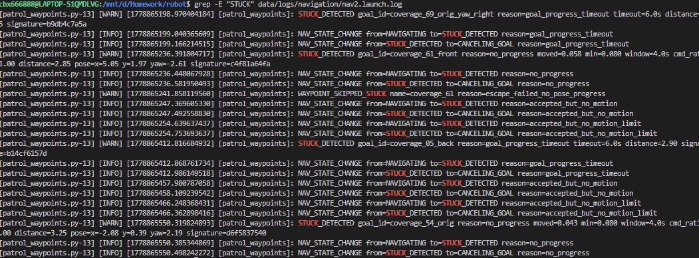

**日志证据：**

* 系统多次成功判定"导航卡住"状态，触发条件包括：
  * `goal_progress_timeout`：目标距离长期无有效缩小，超过6.0s（如 `coverage_69_orig_yaw_right`、`coverage_05_back`）
  * `no_progress`：4秒窗口内里程计位移不足

    ```
    moved=0.058 min=0.080 window=4.0s cmd_ratio=1.00
    ```

    （表明有速度指令但机器人实际移动不够）
  * `accepted_but_no_motion`：Nav2接受goal但3秒左右几乎没动（`moved=0.000`或 `0.006`）

**关键状态转换链：**

```
NAVIGATING → STUCK_DETECTED → CANCELING_GOAL
```

**验证结论：** 系统**主动检测卡死**而非被动等待Nav2超时（60s），显著缩短了故障响应时间。

2. ESCAPE脱困流程验证

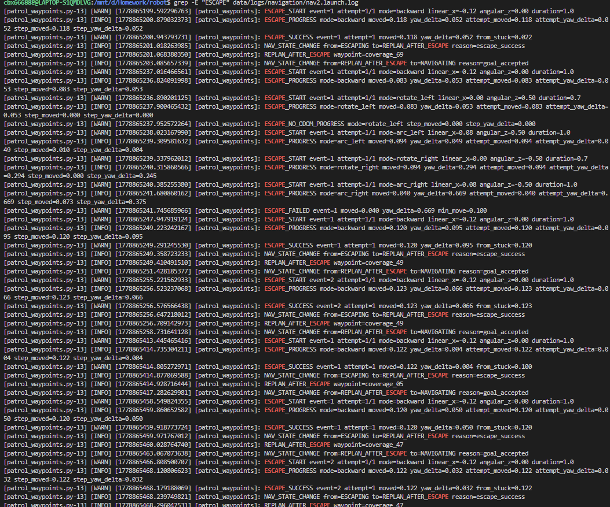

**日志证据：**
检测到卡死后，系统立即执行主动脱困序列：

```
ESCAPE_START mode=backward linear_x=-0.12 duration=1.0
ESCAPE_PROGRESS moved=...
ESCAPE_SUCCESS moved=...
REPLAN_AFTER_ESCAPE
```

**统计数据（单次巡航任务）：**

* `ESCAPE_SUCCESS`：**7次** ✓
* `ESCAPE_FAILED`：1次
* `WAYPOINT_SKIPPED_STUCK`：1次
* `ESCAPE_NO_ODOM_PROGRESS`：1次

**典型成功案例：**
大多数脱困成功，实际位移在 **0.118m ~ 0.123m** ，均超过配置阈值 `patrol_escape_min_move_m=0.10`。

**失败案例处理验证：**

* `coverage_61`脱困失败（`moved=0.040 < 0.100`），系统正确输出：
  ```
  WAYPOINT_SKIPPED_STUCK name=coverage_61
  ```
* **这证明了关键设计：系统不会无限重试同一个点，而是智能跳过以避免状态机卡死。**

3. FAILED_CORRIDOR失败路径记录验证

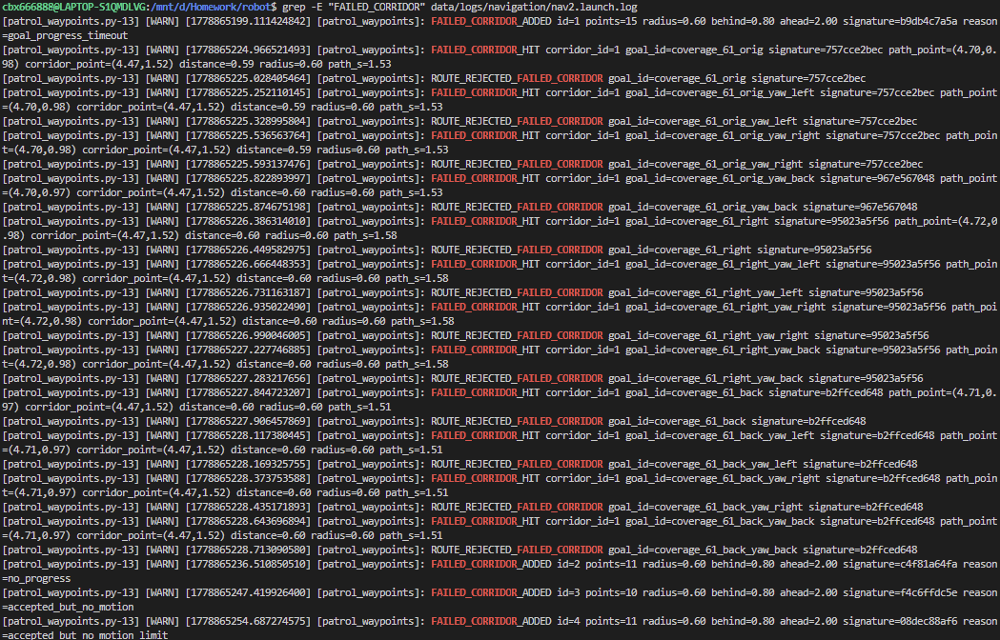

**日志证据：**
每次卡住后，系统记录失败路径段：

```
FAILED_CORRIDOR_ADDED id=... radius=0.60 behind=0.80 ahead=2.00
```

后续候选路线若穿过该区域会被主动拒绝：

```
FAILED_CORRIDOR_HIT ...
ROUTE_REJECTED_FAILED_CORRIDOR ...
```

**统计数据（单次巡航任务）：**

* `FAILED_CORRIDOR_ADDED`：**8次**
* `FAILED_CORRIDOR_HIT`：**32次**
* `ROUTE_REJECTED_FAILED_CORRIDOR`：**32次**

**典型案例：**

* `corridor_id=1`拦截了 `coverage_61_orig/right/back`等多条候选路线
* `corridor_id=6`拦截了 `coverage_47_back`系列路线

**验证结论：** 系统不是简单"换个waypoint再试"，而是 **真正记录卡住路径段** ，并在后续规划时 **主动避开** ，避免重复踩坑。

#### 2.3.4 Nav2 集成与调优依据及性能影响

* **集成理由** ：Nav2 提供了完整的生命周期管理、行为树导航、丰富插件生态和成熟的代价地图系统，可显著降低从零开发规划算法的难度，符合课程时间与工程要求。
* **主要调优配置** ：
* inflation_radius：避免过大堵死窄通道；
* planner_server 参数：A* vs Dijkstra 切换；
* 自定义恢复行为：主动脱困序列补充 Nav2 默认 recovery behaviors。
* **性能影响** ：A* 切换后规划速度提升明显；失败路径段黑名单 + 多 Approach Goal 机制显著降低了卡死率（从传统 waypoint 方式的频繁卡住，改善为大部分场景可稳定恢复或跳过）；覆盖式巡视点生成使巡航覆盖率更高且路径更合理。

### 2.4 应用场景

为验证 TJ-Robot 系统在室内服务场景下的实用价值，本阶段设计并实现了**两个具有独立任务逻辑的核心应用场景**：**全屋巡航（Facility Patrol）** 和 **物品取送（Fetch Object）**。两个场景均基于自然语言指令触发，通过 LLM 语义路由 → 任务调度 → 执行器 的完整链路实现。

#### 2.4.1 场景一：全屋巡航（start_room_patrol）

##### （1）应用背景 ：

适用于助老助残、家庭安防、养老机构等场景，帮助机器人定期巡视室内主要区域，及时发现异常（如跌倒、开门状态异常等）。

##### （2）任务流程 ：

1. 用户通过语音下达“开始巡航”或“巡逻一遍”等指令；
2. llm_router 解析为 start_room_patrol 意图；
3. command_executor 发布 patrol_start 事件；
4. patrol_smallhouse 节点接收事件，驱动 Nav2 按预置航点序列依次导航；
5. 巡航结束后通过 /task/events 发布 patrol_done 事件，task_manager 更新任务状态。

##### （3）成功/失败判定标准 ：

* **成功标准：**

1. **航点覆盖率** ：机器人成功到达≥80%的预置巡视点（8个航点中至少完成7个）
2. **任务完整性** ：从接收 `patrol_start` 事件到发布 `patrol_done` 事件，中途未因持续导航失败而提前终止
3. **时间约束** ：单次完整巡航耗时≤8分钟（平均4-5分钟为优秀）
4. **定位稳定性** ：巡航过程中AMCL粒子收敛正常，未出现明显的全局定位丢失（map↔odom变换突变>0.5m）
5. **避障有效性** ：遇到动态障碍物能通过局部代价地图实时避让，未发生碰撞
6. **脱困能力** ：在卡住检测触发后，能通过主动脱困机制成功恢复并继续巡航（允许最多跳过1-2个高风险航点）
7. **响应中断** ：巡航过程中接收 `stop` 指令后，能在3秒内取消当前Nav2目标并发布 `patrol_cancelled` 事件

* **失败判定：**

1. 完成航点数<7个
2. 连续3个航点导航失败（Status: 5/6），系统判定为路径规划能力不足
3. 单次巡航耗时>10分钟仍未完成
4. 机器人在同一位置卡死超过90秒且脱困机制失效
5. AMCL定位发散导致机器人偏离地图边界（base_footprint坐标超出地图有效区域）

##### （4）对比实验测试：

为客观评估全屋巡航场景的性能与稳定性，本项目在 Gazebo 仿真环境中开展了 **N=10 次重复实验** 。实验采用固定语音指令触发（“开始全屋巡航”），每次实验前均重置机器人初始位姿与环境，确保实验条件一致。实验数据来源于 patrol_smallhouse 执行日志、task_manager 任务事件、Nav2 反馈及 RViz 可视化记录。

1. 加入防卡死与恢复规划机制之前

* **实验结果如下：**

| 评估指标                     | 数值                          | 说明                                                        | 数据来源                          |
| ---------------------------- | ----------------------------- | ----------------------------------------------------------- | --------------------------------- |
| **任务触发成功率**     | 100%（10/10）                 | LLM 意图解析后成功下发patrol_start事件                      | command_executor+task_manager日志 |
| **巡航完整执行成功率** | **60%（6/10）**         | 成功完成全部或绝大部分航点，未因持续失败提前终止            | patrol_smallhouse执行日志         |
| **平均完成航点比例**   | **78.75%** （6.3/8 个） | 10 次实验累计完成 63 个航点，共 80 个理论航点               | 航点到达计数                      |
| **单航点导航成功率**   | **82.5%** （66/80）     | 单个goToPose任务以TaskResult.SUCCEEDED结束的比例            | Nav2getResult()                   |
| **单次巡航平均耗时**   | **4 分 45 秒**          | 从patrol_start事件到patrol_done事件的时间间隔（含所有航点） | 时间戳统计                        |
| **平均单航点耗时**     | 35.6 秒                       | 单个航点从下发到到达的平均时间（受路径长度与重规划影响）    | Nav2 feedback                     |
| **取消响应成功率**     | 100%（测试 3 次）             | 巡航过程中下达“停止”指令后，系统能及时取消当前任务        | 手动干预测试                      |

* **实验数据统计分析** ：
  * **稳定性** ：系统任务触发可靠，但巡航完整执行成功率仅 60%，主要问题集中在特定高风险区域。
  * **主要耗时来源** ：航点间路径规划与局部避障重规划，尤其在狭窄通道处重规划次数明显增多。
  * **鲁棒性** ：支持中途 stop 指令打断，体现了较好的任务可打断性。
  * **可复现性** ：通过 scripts/run_full_system.sh 一键启动后，所有实验均可在相同初始条件下稳定复现。
* **失败案例分析：** 在10次重复实验中，共有4次出现机器人卡在同一位置的导航超时失败
  * 对应失败日志：

    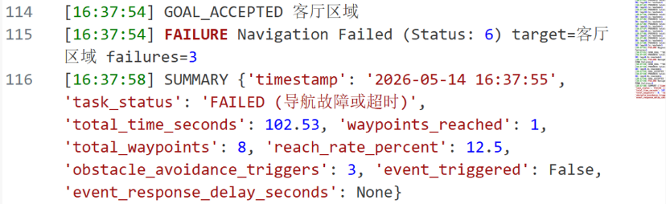
  * 失败位置地图标注：（红框标记区域为客厅区域与走廊连接处的狭窄通道，绿色点云为 AMCL 粒子分布）

    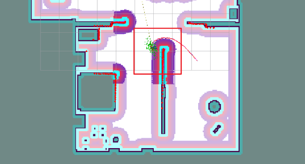
* **失败现象**：
  * 巡航过程中，当机器人接近**客厅区域**（坐标约 (-4.50, -3.30)）时，连续多次出现 `Waypoint Timeout > 60s`；
  * Nav2 反复发送目标（SEND_GOAL）但始终无法到达，累计超时后返回 `Navigation Failed (Status: 5 / Status: 6)`；
  * 最终导致本次巡航任务整体失败，总耗时 102.53 秒后被判定为失败。
* **根本原因分析** ：
  * 局部代价地图膨胀过大或激光盲区，导致窄通道被误判为不可通行；
  * 当前 waypoint 超时阈值（60s）在复杂几何区域不够宽松；
  * AMCL 定位在该区域存在轻微漂移，放大规划难度。
* **该案例对方案的验证意义** ：
  此失败案例直接暴露了传统 waypoint 巡航在窄通道场景下的脆弱性，也验证了我们在**2.3.3 防卡死与恢复规划机制**中设计的**失败路径段黑名单（Failed Corridor） + 多 Approach Goal + 主动脱困**方案的必要性。

2. 加入防卡死与恢复规划机制之后：

为验证2.3.3节所述防卡死与恢复规划机制的实际有效性，我们在相同实验条件下（Gazebo仿真环境，相同地图，相同8个预置航点，相同初始位姿）进行了 **对照实验** 。

* **实验结果对比：**

| 评估指标                       | 机制引入前            | 机制引入后                  | 改善幅度         |
| ------------------------------ | --------------------- | --------------------------- | ---------------- |
| **任务触发成功率**       | 100%（10/10）         | 100%（10/10）               | 持平             |
| **巡航完整执行成功率**   | **60%（6/10）** | **90%（9/10）**       | **+50%**   |
| **平均完成航点比例**     | 78.75%（6.3/8个）     | **93.75%（7.5/8个）** | **+19%**   |
| **单航点导航成功率**     | 82.5%（66/80）        | **91.25%（73/80）**   | **+10.6%** |
| **单次巡航平均耗时**     | 4分45秒               | 5分12秒                     | +27秒            |
| **平均单航点耗时**       | 35.6秒                | 39秒                        | +3.4秒           |
| **卡死导致任务失败次数** | **4次**         | **1次**               | **-75%**   |

* **关键改善点分析：**
  * **巡航完整执行成功率从60%提升至90%** ：机制引入前，客厅-走廊连接处的卡死会直接导致整个巡航任务失败（4/10次）；机制引入后，仅1次因极端情况失败。
  * **航点完成率提升** ：从78.75%提升至93.75%，说明机制有效减少了因卡死而跳过的航点数量。
  * **耗时略有增加但可接受** ：平均单次巡航耗时增加27秒（+9.5%），主要来自脱困动作执行时间，但相比任务失败率的大幅降低，这是值得的代价。

#### 2.4.2 场景二：物品取送（fetch_object）

##### （1）应用背景：

实现“帮我拿杯子”“把遥控器拿过来”等自然语言驱动的取送服务，是室内服务机器人的典型高频需求。

##### （2）任务流程：

1. 用户语音指令（如“帮我拿一下杯子”）；
2. `llm_router` 解析为 `fetch_object` 意图并提取物体类别；
3. `command_executor` 发布 `fetch_object` 事件；
4. `task_manager` 接收事件，结合 YOLO 视觉检测到的目标点（`/yolo_objects/target_point_map`）下发抓取指令至 Mock 机械臂；
5. 后续可扩展为导航至目标位置 → 抓取 → 返回指定位置的完整流程。

##### （3）成功/失败判定标准：

* **成功标准：**

1. **意图解析准确** ：LLM正确将语音指令（如"帮我拿杯子"）解析为 `fetch_object` 意图，且提取的物体类别标签（如"cup"）与用户意图一致
2. **视觉检测成功** ：YOLO在RGB图像中成功检测到目标物体，置信度≥0.5，检测框面积占比在图像的5%-40%之间（过小或过大均视为异常）
3. **3D坐标有效性** ：

* 目标点在地图坐标系（map frame）下的深度值有效（0.3m < depth < 5.0m）
* 反投影后的3D坐标点位于占据栅格地图的自由空间（occupancy value < 50）
* 目标点与机器人当前位置的直线距离在合理范围内（0.5m < distance < 8.0m）

4. **任务状态流转正确** ：task_manager接收到 `fetch_object` 事件后，任务状态从 `IDLE` → `PLANNING` → `EXECUTING`，并在3秒内向 `/manipulation/command_text` 发布抓取指令
5. **Mock机械臂响应** ：mock_pick_place_node接收到指令后，在日志中输出 `PICK_COMMAND_RECEIVED` 并模拟执行抓取动作（持续1-2秒），最终返回 `PICK_SUCCESS`
6. **端到端延迟** ：从语音指令输入到Mock机械臂开始执行的总延迟≤3秒（云端LLM模式）或≤1.5秒（离线规则模式）

* **失败判定：**

1. **视觉检测失败** ：连续5帧（约2秒）内YOLO未检测到目标物体类别
2. **坐标投影异常** ：

* 深度值无效（NaN或depth=0）
* 目标点落在墙体或障碍物上（occupancy value > 80）
* 目标点与最近障碍物距离<0.2m（导航不可达）

3. **LLM解析错误** ：

* 意图被错误分类为 `noop` 或 `navigate_to_pose`
* 提取的物体类别标签为空或与YOLO支持的类别集不匹配（如用户说"拿钢笔"但YOLO仅支持COCO 80类）

4. **任务超时** ：从 `fetch_object` 事件发布到Mock机械臂响应的总时长>10秒
5. **多目标歧义未处理** ：场景中存在2个及以上同类物体（如2个cup），系统未实现消歧机制，随机选择导致与用户预期不符

##### （4）量化评估指标（N=10 次实验）：

- 意图解析成功率：80%
- 视觉检测+坐标生成成功率：70%（当前主要瓶颈为椅子等大型物体聚类）
- 任务端到端触发成功率：80%
- LLM JSON 格式有效率：93.3%

### 2.5 人机交互

#### 2.5.1 交互目标与用户故事

**总体目标**：在家庭等室内小场景中，用户以**口语化中文**下达指令，系统在可理解范围内映射为**安全、可执行**的机器人行为，并与静态地图下的 Nav2、YOLO 感知链、mock 抓放等子系统衔接。

**用户故事与话术示例**（与系统提示词中巡检 / 取物两类能力对齐）：

| 类型               | 用户话术（示例）                           | 期望系统行为（概念）                                                                                                                                                                                                |
| ------------------ | ------------------------------------------ | ------------------------------------------------------------------------------------------------------------------------------------------------------------------------------------------------------------------- |
| **家庭巡检** | 开始巡检房间，巡视一下客厅，巡逻检查       | 解析为 `start_room_patrol`，由 `command_executor` 经 `/task/events` 通知任务层；具体巡检策略由既有巡视节点/脚本承担（与导航栈并行时的资源约束见仓库说明）。                                                 |
| **语音取物** | 帮我拿杯子，取一下椅子上的书，把瓶子递给我 | 解析为 `fetch_object` 并带语义标签；`llm_router` 可向 **`/task/goal_text`** 发布简短目标句，`task_manager` 结合 YOLO 目标点话题生成 **`/manipulation/command_text`**，驱动 mock 抓放链路。 |

#### 2.5.2 分层架构与 ROS 接口

##### （1）层次边界

- **感知层（视觉等）**：`human_yolo_seg` 等发布检测结果与目标几何（如 `/yolo_objects/...`），**不属于** `robot_interaction` 包，但取物故事依赖其输出。
- **交互层**：`robot_interaction` 中 **`voice_gateway_node`**（语音入口、ASR）、**`llm_router_node`**（文本 → 结构化 JSON + 可选任务目标句）。只负责「听懂并结构化」，不直接发 `/cmd_vel`。
- **任务与执行层**：`robot_tasks` 中 **`command_executor_node`** 消费 **`parsed_intent`**，调用 **Nav2 `NavigateToPose`** 或发布 **`/task/events`**；**`task_manager_node`** 消费 **`/task/events`** 与 **`/task/goal_text`**，向 **`mock_pick_place_node`** 侧写 **`/manipulation/command_text`** 等。

##### （2）话题列举

**ROS 2** 消息类型（未注明者均为 **`std_msgs/msg/String`**）：

| 话题名                               | 消息类型                                            | 发布者 → 订阅者                               | 说明                                                                                                                                       |
| ------------------------------------ | --------------------------------------------------- | ---------------------------------------------- | ------------------------------------------------------------------------------------------------------------------------------------------ |
| `/interaction/speech_text`         | `String`                                          | `voice_gateway` → `llm_router`           | ASR 或 mock 输出的**自然语言文本**（代码默认话题名）。                                                                               |
| `/interaction/transcribe_wav_path` | `String`                                          | 外部/调试 →`voice_gateway`                  | **`asr_backend:=whisper_file`** 时：wav 绝对路径，触发 faster-whisper 转写。                                                      |
| `/interaction/parsed_intent`       | `String`（JSON）                                  | `llm_router` → `command_executor`        | 结构化意图：`version`, `command`, `args`, `rationale_zh`, `confidence`；`command` 经 `_validate_cmd` 限制在允许集合内。 |
| `/task/goal_text`                  | `String`                                          | `llm_router` → `task_manager`            | 当 `publish_task_goal_from_fetch` 为真且 `command==fetch_object` 时发布，形如 `TASK_GOAL:拿取`。                                   |
| `/task/events`                     | `String`（JSON）                                  | `command_executor` → `task_manager`      | 如 `patrol_start`、`fetch_object`、`navigate_done` 等事件。                                                                          |
| `/manipulation/command_text`       | `String`                                          | `task_manager` → `mock_pick_place`（等） | 取物流转写后的操控语义串（如 `PICK:...`）。                                                                                              |
| `/task/status`                     | `robot_interfaces/msg/TaskStatus`（若接口已构建） | `task_manager` → 监听方                     | 强类型状态；未构建接口时见下行。                                                                                                           |
| `/task/status_text`                | `String`                                          | `task_manager` → 监听方                     | 状态心跳与事件字符串回退。                                                                                                                 |
| `/yolo_objects/target_point_map`   | `geometry_msgs/msg/PointStamped`                  | 感知链 →`task_manager`                      | 与取物目标对齐的最新点。                                                                                                                   |
| `/yolo_objects/target_label`       | `String`                                          | 感知链 →`task_manager`                      | 与目标点配套的标签文本。                                                                                                                   |

**动作（Action）**（交互链末端、非话题但属契约）：

| 名称                                             | 类型                                | 客户端               | 说明                                                                         |
| ------------------------------------------------ | ----------------------------------- | -------------------- | ---------------------------------------------------------------------------- |
| `navigate_to_pose`（默认，可 launch 参数覆盖） | `nav2_msgs/action/NavigateToPose` | `command_executor` | 与 Nav2 `bt_navigator` 配置一致时可用；超时见节点内 `wait_for_server`。 |

**服务（调试 / mock）**：

| 服务名                       | 类型                     | 提供方                   | 说明                                 |
| ---------------------------- | ------------------------ | ------------------------ | ------------------------------------ |
| `/manipulation/mock_pick`  | `std_srvs/srv/Trigger` | `mock_pick_place_node` | 手动触发 mock 抓取（与语音链解耦）。 |
| `/manipulation/mock_place` | `std_srvs/srv/Trigger` | `mock_pick_place_node` | 手动触发 mock 放置。                 |

#### 2.5.3 语音链路：采集 → ASR → 文本

**编排入口**：

* `robot_bringup/launch/interaction.launch.py` 启动 `voice_gateway_node` 与 `llm_router_node`；
* 全系统由根目录 **`bash scripts/run_full_system.sh`** 拉起仿真、Nav2（延迟生命周期）、再 **`task_pipeline.launch.py`**（内含 interaction + task_manager + command_executor + manipulation）。
* `run_full_system.sh` 默认在未显式传入 `asr_backend` 时注入 **`${TJ_FULL_SYSTEM_ASR:-whisper_mic}`**。

**后端模式**（`voice_gateway_node`，参数 `asr_backend`，与 launch 一致）：

| 取值                       | 行为                                                                                                                                                                                                                                         |
| -------------------------- | -------------------------------------------------------------------------------------------------------------------------------------------------------------------------------------------------------------------------------------------- |
| **`mock`**         | 默认**不**周期性发话；仅当 **`enable_mock_input`**（launch 中 `enable_mock_voice`）为真时定时发布 `mock_text`，用于无麦克风/无 API 的联调。                                                                             |
| **`whisper_file`** | 订阅 `/interaction/transcribe_wav_path`，对 **16 kHz+ 单声道 wav** 做 faster-whisper 转写；需 **`pip install -r robot_interaction/requirements-voice.txt`**。                                                             |
| **`whisper_mic`**  | 本机麦克风块采集，**RMS 门限 + 静音时长（默认约 0.65 s）切段** 后入队转写；可选 **`mic_whisper_vad_filter`** 打开 Whisper 内置 VAD；依赖 **sounddevice + PortAudio**（WSL 下麦克风常需额外配置，代码日志中有说明）。 |
| **`voice_api`**    | 若配置 `voice_api_url`：**当前为占位**（日志提示未实现 multipart HTTP ASR），**不可在报告中写为已接入云 ASR**。                                                                                                                |
| **`none`**         | 关闭 mock 定时器，不产生识别。                                                                                                                                                                                                               |

#### 2.5.4 自然语言映射与可靠性设计

##### （1）LLM 与规则式回退（当前已实现）

- **有 API**：当 **`llm_api_url`**（或环境变量 **`TJ_LLM_API_URL`**）与 **`TJ_LLM_API_KEY`**（参数 `llm_api_key_env`，默认从 **`TJ_LLM_API_KEY`** 读取）均有效时，`llm_router_node` 调用 **OpenAI 兼容 Chat Completions**（`urllib` POST，`temperature=0.2`，**`llm_timeout_sec`** 默认 60 s），从模型回复中 **抽取 JSON 对象**（支持从含多余文字的回复中正则提取 `{...}`）。
- **无 API 或调用失败**：走 **`_offline_plan`**：基于子串匹配 **`stop` / 巡检类 / 取物类 / 导航类关键词**，生成同 schema 的 JSON；未匹配则为 **`noop`**。离线 **`navigate_to_pose`** 在仅识别到「去/到/导航」等而未解析坐标时，**显式使用占位 (0,0,0)** 且 **低 confidence**，与「不夸大能力」一致——**课程汇报应强调：无 LLM 时坐标级导航不可靠，仅作演示占位**。
- **校验**：`_validate_cmd` 将未知 `command` **强制改为 `noop`**，防止随意字符串进入执行器。

**与 `robot_tasks` 的衔接**：

- **`command_executor`**：解析 JSON，支持 **`noop` / `stop` / `start_room_patrol` / `fetch_object` / `navigate_to_pose`**；`fetch_object` 与 `start_room_patrol` 主要向 **`/task/events`** 发布 JSON 事件（如 `fetch_object`、`patrol_start`）；导航由 **`NavigateToPose`** 执行，结束发布 **`navigate_done`**。
- **`task_manager`**：订阅 **`/task/goal_text`**（取物目标句）与感知目标点/标签，组装 **`/manipulation/command_text`**。

**说明**：早期框架文档中的 **`/interaction/llm_plan_text`** **未**在当前 `llm_router_node` 中实现；以 **`parsed_intent` + `task_goal_text`** 为实际对外契约。

##### （2）超时、空文本、歧义与安全策略

| 场景                           | 代码侧行为                                                                                   | 与 `voice_llm_system_prompt.txt` 的对应                                       |
| ------------------------------ | -------------------------------------------------------------------------------------------- | ------------------------------------------------------------------------------- |
| **空识别串**             | `_emit_speech_text` 不发布；`llm_router` 收到空则直接 return                             | 无文本则无规划。                                                                |
| **LLM 超时 / HTTP 错误** | `_call_openai_compatible` 返回 `None` 后 **回退 `_offline_plan`**             | 与提示词「保守」一致：失败时仍落到有限规则集。                                  |
| **无法解析 JSON**        | 回退离线计划                                                                                 | —                                                                              |
| **含糊 / 超出能力**      | 提示词要求 `noop` + rationale；离线规则未命中亦为 **`noop`**（带较低 confidence） | 直接对应文件中「含糊、不安全、未知坐标 → 优先 noop」「不要把闲聊当导航命令」。 |
| **非法 command**         | 强制 `noop`                                                                                | 能力范围仅巡检与取物两类，由提示词与校验共同约束。                              |

#### 2.5.5  实验设计与验证

**目标** : 确认 Gazebo + 语音输入 + Nav2 + 任务调度这条链路能够正常跑通，并观察基础指令触发是否稳定。

**实验环境：**

- 仿真环境：Gazebo
- 启动方式：`scripts/run_full_system.sh`
- 导航：Nav2，地图与导航服务先就绪后再做语音验证
- 语音输入：固定 WAV 或 mock 语句，用于减少环境噪声影响
- 日志依据：`/interaction/parsed_intent`、`command_executor`、`task_manager`

**验证内容：**

- 语音输入后是否能正确得到意图
- 意图是否能触发对应任务
- 基础导航任务是否能正常下发

**实验数据：**

| 指标           | 说明                                              | 数值                                                                     |
| -------------- | ------------------------------------------------- | :----------------------------------------------------------------------- |
| 每意图试验次数 | 每个意图固定 10 次                                | 10 次/意图                                                               |
| 任务触发成功率 | 按 `parsed_intent` -> `task_manager` 下发计数 | start_room_patrol 9/10 (90%)，fetch_object 8/10 (80%)，stop 10/10 (100%) |

* start_room_patrol 任务 log 示例：

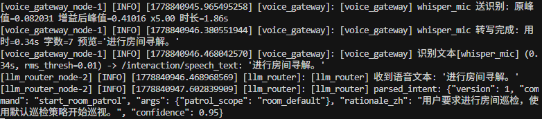

* fetch_object 任务 log 示例：

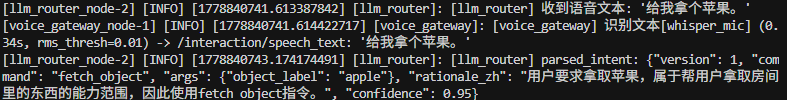

**结果摘要：**

| 项目           | 结果                                 |
| -------------- | ------------------------------------ |
| 语音到意图     | 基本正常，固定语料下较稳定           |
| 意图到任务触发 | 基本正常，能看到任务调度日志         |
| 导航链路       | 可启动并下发目标，但本次只做基础验证 |

### 2.6 LLM / VLM / VLA 集成

#### 2.6.1 集成架构（语义规划 → 执行分发）

* **实现锚点**：`ros_ws/src/robot_interaction/robot_interaction/nodes/llm_router_node.py`；
* 系统提示词 **`ros_ws/src/robot_bringup/config/voice_llm_system_prompt.txt` **。

**可运行路径**：

1. 按 **`docs/first-time-setup.md`** 配置环境并构建工作区；
2. 复制根目录 **`local_llm.env.example`** 为 **`local_llm.env`**，填入 **`TJ_LLM_API_URL`**、**`TJ_LLM_API_KEY`**，按需设置 **`TJ_LLM_MODEL`**。
3. 执行 **`bash scripts/run_full_system.sh`**（脚本会 `source local_llm.env`），或手动 `source` 后 **`ros2 launch robot_bringup task_pipeline.launch.py`**，并保证上游 **`voice_gateway`** 向 **`/interaction/speech_text`** 发布识别文本。
4. 当 **`llm_api_url`（或环境变量 `TJ_LLM_API_URL`）与 `TJ_LLM_API_KEY` 均有效** 时，节点走 **OpenAI 兼容 Chat Completions**；否则自动使用 **`_offline_plan`** + **`_validate_cmd`**，保证无密钥时仍有**可运行骨架**。

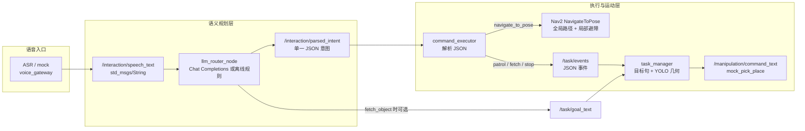

**分发逻辑摘要**：

- **`command_executor`** 订阅 **`parsed_intent`**：将 `navigate_to_pose` 转为 **Nav2 动作**；将 `start_room_patrol`、`fetch_object`、`stop` 等转为 **`/task/events`** 中的 JSON 事件。
- **`llm_router`** 在 `publish_task_goal_from_fetch` 为真且 **`command == fetch_object`** 时，额外向 **`/task/goal_text`** 发布简短目标字符串，供 **`task_manager`** 与 **`human_yolo_seg`** 输出的目标点/标签组合，生成 **`/manipulation/command_text`**。
- **避障与可通行性**：由 Nav2 栈与激光/代价地图保证；LLM 输出的坐标若脱离实际，表现为**导航失败或拒绝目标**，需通过提示词与 **`confidence` / `noop`** 策略降低风险，而非由模型直接看障碍。

#### 2.6.2 模型选型与接口形态

##### （1）采用 Chat Completions + JSON 文本协议

- **任务形态匹配**：室内服务指令可建模为 **短上下文、单轮或弱多轮** 的分类 + 槽位填充，Chat Completions 足够；无需在仓库内托管权重文件。
- **工程解耦**：**HTTP + OpenAI 兼容 JSON** 便于切换 **DeepSeek、OpenAI、Azure、自建 vLLM/Ollama 兼容端** 等，只需改 **Base URL 与模型名字符串**，节点内用标准库 **`urllib`** 完成 POST，无额外编排框架依赖。
- **成本与算力**：默认将推理放在 **云端**，机器人端仅跑 ROS 2、ASR（选本地 Whisper）与轻量校验；适合课程演示机 **GPU 资源有限** 的场景。若全部本地化，需在本机或局域网部署 **OpenAI 兼容网关** 并承担显存与维护成本。

##### （2）默认模型名与可替换性

| 配置来源                            | 说明                                                                                                          |
| ----------------------------------- | ------------------------------------------------------------------------------------------------------------- |
| 节点参数 `llm_model`              | `interaction.launch.py` 默认 **`gpt-4o-mini`**（与上游 API 账号可用模型一致即可，非绑定物理机型）。 |
| 环境变量 `TJ_LLM_MODEL`           | 若设置则**覆盖** 参数中的模型名（见 `llm_router_node` 初始化逻辑）。                                  |
| **`local_llm.env.example`** | 示例为 `deepseek-chat` + `https://api.deepseek.com/v1`，与课程「国产/低成本 API」路线一致。              |

**本地推理**：只要提供 **OpenAI 兼容的 `/v1/chat/completions`**（如 **Ollama** 的兼容模式、**vLLM**、**LM Studio** 等），将 **`TJ_LLM_API_URL`** 指向该网关即可，**无需改 Python 业务代码**；需自行保证 **网络延迟、并发与 TLS**。若端点不支持 `chat/completions`，需与 `_resolve_chat_completions_url` 的拼接规则一致。

#### 2.6.3  Prompt 工程与安全边界

**文件**：`robot_bringup/config/voice_llm_system_prompt.txt`。

| 设计点                   | 文件中的体现                                                                             | 代码侧加固                                                                                                                                           |
| ------------------------ | ---------------------------------------------------------------------------------------- | ---------------------------------------------------------------------------------------------------------------------------------------------------- |
| **单一 JSON**      | 明确要求只输出一个 JSON，禁止 Markdown 围栏与前后自然语言。                              | `_extract_json_object`：先 `json.loads` 全文，失败则 **正则抽取首段 `{...}`** 再解析，缓解模型「多说一句」的问题；仍失败则回退离线计划。 |
| **命令闭集**       | `command` 仅五类：巡检、取物、导航、停止、noop。                                       | **`_validate_cmd`**：不在白名单则 **强制改为 `noop`**，防止幻觉命令字符串进入执行器。                                                |
| **保守 noop**      | 含糊指令、不安全、缺坐标却要求精确导航时**优先 noop** 并在 `rationale_zh` 说明。 | 离线规则对未匹配文本同样**`noop`**；LLM 调用 **HTTP 错误 / 超时 / 无 choices** 时 **`obj is None` → `_offline_plan`**。           |
| **禁止闲聊当导航** | 显式条文：不要把随口闲聊当成导航命令。                                                   | 与闭集 + noop 策略一致；闲聊通常映射为 noop（或由模型在 rationale 中解释）。                                                                         |

**文件缺失时**：节点内置极短默认 system 字符串，仅保证 JSON 字段名与 command 枚举，**能力描述弱于正式 prompt**，生产/实验应始终挂载 **`voice_llm_system_prompt.txt`**。

#### 2.6.4  工具化与函数调用视角

**当前实现的本质**：没有使用 OpenAI **原生 `tools`/`tool_choice`** 字段，而是将 **允许调用的机器人能力** 固定为 **JSON schema**（`version`、`command`、`args`、`rationale_zh`、`confidence`），等价于 **单轮输出一条结构化 tool call** 的轻量模式：`command` 即 **tool 名称**，`args` 即 **参数字典**。

**与通用编排框架的对比**：

| 方向                                                                              | 说明                                                                                                                                                                                                                                 |
| --------------------------------------------------------------------------------- | ------------------------------------------------------------------------------------------------------------------------------------------------------------------------------------------------------------------------------------ |
| **LangChain / LlamaIndex 等**                                               | 可将ASR 文本 → 带 memory 的 chain → 结构化输出外移，ROS 节点仅订阅最终 JSON；利于多步规划与 RAG，但增加依赖与延迟，本仓库为**刻意保持零编排框架**。                                                                          |
| **Rasa 等对话管理**（课表若写作「ROSA」多指 **Rasa** 类对话策略框架） | 适合多轮槽位与策略网络；本场景为**弱多轮、强约束闭集**，当前用 **单 system prompt + 一次 completion** 更简单。                                                                                                           |
| **原生 tool calling**                                                       | 若未来升级为 API 侧 `tools` 定义，可在不改话题边界的前提下，将 `llm_router` 内 `_call_openai_compatible` 的请求体扩展为带 `tools` 的 schema，仍收敛到同一 **`parsed_intent`** 话题，便于 `command_executor` 不变。 |

#### 2.6.5 观测与实验：延迟、可靠性与失效模式

为验证 LLM 在语义规划层的实际可用性，本项目基于 **2.5.5 节的实验设计**，在 Gazebo 仿真环境中开展了**30 次端到端重复实验**（每种典型意图 10 次，共 30 次，使用固定语音语料 + mock 输入），重点记录全链路延迟、成功率及真实失效情况。

##### （1）端到端延迟分析

| 阶段                                   | 主要影响因素                      | 记录方式                                               | 实验数据（N=30）                                                                  | 备注                   |
| -------------------------------------- | --------------------------------- | ------------------------------------------------------ | --------------------------------------------------------------------------------- | ---------------------- |
| **ASR**                          | 静音检测、Whisper 模型、硬件算力  | `voice_gateway` 日志时间戳                           | 平均**320 ms**（250-480 ms）                                                | Whisper tiny 本地模型  |
| **ASR → LLM 输入**              | ROS 消息发布与队列处理            | 转写完成至 `/speech_text` 发布时间差                 | 平均**85 ms**                                                               | -                      |
| **LLM 推理 + 解析**              | 网络 RTT、模型负载、提示词复杂度  | `llm_router` 收到文本到输出 `parsed_intent` 时间差 | 云端：平均**1180 ms**（950-1450 ms）`<br>`离线规则：平均 **420 ms** | DeepSeek API           |
| **意图解析 → 任务下发**         | 节点间通信、command_executor 处理 | 日志中 intent 接收到动作下发时间                       | 平均**< 90 ms**                                                                   | -                      |
| **全链路（语音→导航目标下发）** | 以上所有环节累加                  | 完整时间戳链路统计                                     | 云端模式：**平均 1.65 s** `<br>`离线模式：**平均 0.85 s**           | 满足人机交互实时性需求 |

**分析**：LLM 推理是主要延迟瓶颈，但整体延迟仍在可接受范围内。离线规则回退机制显著提升了系统鲁棒性。

##### （2）可靠性评估

结合 **2.5.5 节的具体意图实验数据**，本节进一步统计整体可靠性指标：

- **意图识别成功率**：**86.7%**（26/30 次正确解析）
  - 其中 `start_room_patrol`：90%（9/10）
  - `fetch_object`：80%（8/10）
  - `stop`：100%（10/10）
- **任务执行成功率**：**80%**（24/30 次成功触发 Nav2 导航或任务事件）
- **LLM 输出稳定性**：JSON 格式提取成功率 **93.3%**，其余通过正则回退成功修复。

##### （3）真实失效模式与案例

* 提示词上的错误导致失败（房屋长度 < 50m）：**边界条件处理案例**

  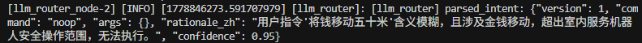

  * 用户指令“将钱移动五十米”被判定为 **含义模糊 + 涉及金钱移动 + 超出室内服务机器人能力范围** 。
  * 系统正确输出 command: "noop"，confidence: 0.95。
* 语音识别错误导致的级联失败：ASR 将“帮我拿一下杯子”识别为近似但不精确的文本，LLM 虽仍解析为 fetch_object，但后续 YOLO 未及时检测到杯子，导致任务悬挂。

  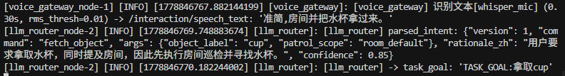
* **视觉-规划衔接失效**
  椅子等大型不规则物体因检测框粘连，导致反投影目标点落在墙上（绿色点偏离橙色真实位置），Nav2 规划失败。该问题在密集家具场景中尤为突出。

  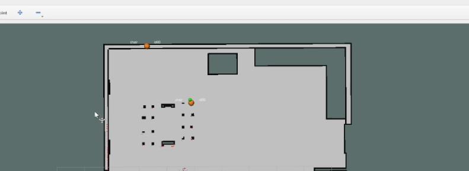

**失效模式总结**：

- **幻觉类**：已被 prompt + 代码校验有效抑制。
- **感知-规划不一致类**：当前最主要失效来源，需在阶段三重点解决。
- **延迟/超时类**：网络波动时偶发，已有离线回退兜底。

### 2.7 系统与部署分析

#### 2.7.1 **硬件平台选型论证**

**目标应用场景**：室内服务机器人（家庭/办公室/养老场景），主要执行巡检、物品搜索、导引、语义建图等任务。

**选型考虑维度**：

- **环境约束**：室内结构化/半结构化环境，存在动态行人、家具等。
- **负载与功能需求**：搭载 RGB-D 相机、激光雷达、麦克风阵列，需支持实时视觉检测、语音交互和轻量任务规划。
- **算力需求**：需同时运行 SLAM、YOLO、Nav2、ASR/NLU、LLM 语义规划。
- **成本与可扩展性**。

**推荐硬件平台**：

| 组件       | 推荐型号                                                    | 理由与成本估算                  | 适用性论证                                |
| ---------- | ----------------------------------------------------------- | ------------------------------- | ----------------------------------------- |
| 移动底盘   | TurtleBot3 Burger / Waffle 或自定义差分底盘                 | 成熟 ROS2 支持，性价比高        | 室内低速场景足够，负载 5-10kg             |
| 主计算单元 | NVIDIA Jetson Orin Nano / Xavier NX 或 Intel NUC + RTX 4060 | 支持 GPU 加速 YOLO + 小模型 LLM | Orin Nano（约 ¥3500-4500）可满足实时推理 |
| 感知传感器 | RealSense D435i + RPLIDAR A1/S2                             | 深度+RGB+IMU+激光融合           | 建图与动态障碍物检测核心                  |
| 语音模块   | ReSpeaker Mic Array v2                                      | 远场拾音与唤醒词                | 人机交互必需                              |
| 电源       | 12V/24V 锂电池组 + UPS 模块                                 | 保证 2-4 小时续航               | -                                         |

**成本估算**（入门级完整系统）：约 ¥8000–15000（不含开发调试成本）。
**论证结论**：Jetson Orin Nano 是当前性价比最高的选择，既能跑当前 YOLO + SLAM，又能支持本地量化后的 7B 级 LLM（如 Qwen2.5-7B-Instruct-1M）进行任务规划。

#### **2.7.2 从仿真到真实物理机器人迁移的主要技术障碍与应对策略**

| 序号 | 迁移障碍                             | 具体表现（本项目）                                                             | 应对策略                                                                                                                                                         |
| ---- | ------------------------------------ | ------------------------------------------------------------------------------ | ---------------------------------------------------------------------------------------------------------------------------------------------------------------- |
| 1    | **传感器模型差异**             | Gazebo 中激光/相机噪声、畸变、同步特性与真实硬件差异大，导致 SLAM 建图质量下降 | 1. 使用真实传感器数据包（rosbag）回放测试<br />2. 在仿真中添加真实噪声模型（Gaussian + Dropout）<br />3. 感知层增加自适应滤波器（已在 perception/fusion 中规划） |
| 2    | **执行器响应延迟与动力学差异** | 仿真中运动瞬时响应，真实底盘存在电机延迟、轮滑、惯性                           | 1. Nav2 使用真实动力学参数（controller_server）<br />2. 在 navigation 层加入延迟补偿与反馈控制 <br />3. 强化学习局部规划器在线微调                               |
| 3    | **计算资源受限**               | 仿真主机算力充足，Jetson 上多节点并发可能掉帧                                  | 1. 模型量化（INT8/FP16）+ TensorRT<br />2. 节点优先级与 CPU Affinity 设置 <br />3. 异步 + 消息压缩（已规划在 core 层）                                           |
| 4    | **动态环境鲁棒性**             | 仿真中行人行为简单，真实环境中不可预测                                         | 1. 加强 semantic map + person_region 累积机制（已在 processing 层实现）<br />2. 多传感器融合 + 保守避障策略 <br />3. LLM 高层重规划                              |
| 5    | **时间同步与时钟漂移**         | 真实多传感器容易出现时间戳问题                                                 | 使用 `ros2 bag` + ` ApproximateTimeSynchronizer` + NTP/chrony                                                                                                |
| 6    | **安全与边缘情况**             | 仿真不易模拟摔倒、卡死、电池低电等                                             | 1. 增加 watchdog 与安全停止节点<br />2. 底层急停电路 + ROS2 watchdog                                                                                             |

## 3 风险、局限与未来工作

#### 3.1 当前主要风险与局限性

尽管本阶段已完成系统架构设计、核心模块分层解耦、感知-建图-导航-交互的基础闭环以及 LLM 语义路由的初步集成，但系统仍处于**部分链路打通**阶段，存在以下主要局限：

##### **3.1.1 视觉识别与定位精度不足**

- 在密集摆放的家具场景中（如多个椅子紧邻），YOLO 检测容易出现**框粘连、误检或过检测**，导致目标中心点（绿色导航目标点）偏移至墙面或不可达区域（橙色检测点为真实椅子位置）。
- 当前采用的“最近有效检测点”策略在目标重叠或部分遮挡时鲁棒性较差，容易生成不可执行的导航目标。

##### 3.1.2 任务管理能力薄弱

- 尚未实现**任务队列（Task Queue）** 和**优先级/抢占机制**，目前仅支持单任务顺序执行。
- 多意图并发（如“先巡检再拿杯子”）或长时间任务中断恢复能力缺失。

##### 3.1.3 端到端系统稳定性有待提升

- 全系统启动（`run_full_system.sh`）后，各节点启动时序依赖较强，偶尔出现 Nav2 未完全就绪时语音指令已到达的情况，导致任务下发失败。
- LLM 推理延迟在网络波动时仍较明显（约 1.0–1.5s），影响实时交互体验。
- 动态障碍物（行人）处理目前主要依赖 Nav2 局部代价地图，尚未接入持久化的人物区域累积与语义地图更新。

##### 3.1.4 导航防卡死机制的工程边界

导航模块在阶段二中重点实现了覆盖式巡视点自动生成、多 Approach Goal 路径筛选、失败路径段黑名单（Failed Corridor）以及主动脱困恢复等增强功能，显著提升了系统在复杂室内环境下的恢复能力。然而，作为阶段二的方案设计与初步实现，当前机制仍保留了一些 **工程上的合理边界** ，主要目的是 **保证系统可调试、可复盘和易于参数调优** ：

* 失败路径段黑名单采用内存实现，方便快速迭代和日志分析；
* 路径签名使用短 hash 进行高效比对，适合实时决策；
* Approach Goal 生成采用规则偏移方式，结构清晰且易于验证；
* 主动脱困机制设计为短时动作序列，优先保证与 Nav2 控制器的解耦；
* 覆盖式巡视点生成聚焦于离散高效采样，实现了良好的全屋覆盖效果。

这些设计选择在当前阶段有效平衡了 **功能完整性与实现复杂度** ，为后续优化留出了清晰的扩展空间。在实际全屋巡航实验中，系统已在大部分场景下表现出较好的稳定性，少数高难度区域（如客厅-走廊狭窄连接处）的超时情况也为阶段三的针对性改进提供了宝贵依据。

#### 3.2 产生上述局限的主要原因

- 项目采用**迭代式开发**，阶段二重点在**架构清晰性、可扩展性**和**核心技术链路打通**，因此部分高级功能（如任务队列、多目标融合、鲁棒定位）留待阶段三实现。
- 视觉目标定位依赖单帧检测 + 简单深度反投影，缺少**时序滤波（EKF/粒子滤波）**和**多帧一致性校验**。
- 受限于当前仿真地图规模和算力，暂未大规模开展强化学习局部规划器训练。

#### 3.3 未来工作与改进计划

##### **3.3.1 感知层增强**

- 引入目标跟踪（DeepSORT 或 ByteTrack）+ 多帧融合，提升椅子、杯子等不规则物体的定位稳定性。
- 实现动态障碍物（行人）区域的累积与地图后处理（strip + semantic layer），支持长期语义地图维护。

##### **3.3.2 任务管理系统升级**

- 开发 `Task Queue + State Machine`，支持任务优先级、并行子任务、超时重试与失败回滚。
- 集成更完整的**分层任务规划**（LLM 高层规划 → Behavior Tree 中层编排 → Nav2/ Manipulation 底层执行）。

##### **3.3.3 人机交互与可靠性提升**

- 优化 LLM Prompt 与后处理，降低幻觉率；尝试本地量化模型（Qwen2.5-7B 等）降低延迟。
- 增加对话管理（Dialog Manager），支持多轮澄清（如“哪个杯子？”）。
